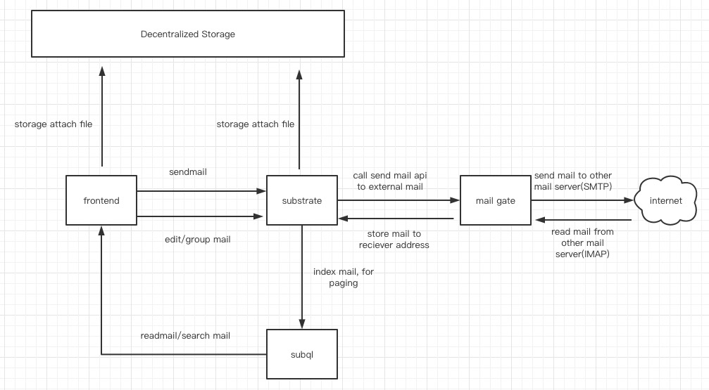

## basic information

Project name: PMail
Project approval date (month and year): November 2022

## Project overall introduction

Mail service is the longest-surviving means of communication on the Internet today. There are more than 4 billion mailbox users in the world, accounting for more than 50% of the world's total population, and it still maintains an annual growth rate of 3%.

The email product design looks very complete, but there are still 3 main pain points:
① Information leakage: the content of the email can be monitored/peeked by the service provider;
② Loss of information: the service provider may stop the service at any time, refer to: Yahoo Mail;
③ Spam.

Technically, we will develop a decentralized relational index based on Substrate, use off-chain working machines to develop a decentralized mail gateway, and deploy Arweave to achieve permanent front-end operations. Thus providing any user with a secure, trustless and permissionless persistent mail service.

## Things planned to be done during the hackathon
In this project, we will provide the following functions:
① the platform adopts wallet login design, no threshold;
② Integrate communication channels to realize intercommunication between web2 & web3 emails;

**blockchain**

- `pallet-mail`
  - [ ] bind mail address to substrate address (`fn bind_address()`)
  - [ ] send mail (`fn send_mail()`)
  - [ ] set contact alias (`fn set_alias()`)
  - [ ] offchain worker sync mail between web2 and web3

**client**
- webend
  - [ ] user login page
  - [ ] mail list page
  - [ ] create mail page
  - [ ] contact list page

**backend**
- mail api server
  - [ ] create web2 mail
  - [ ] get mail from web2
  - [ ] upload mail body to Decentralized Storage
- subql end
  - [ ] get email list from blockchain
  - [ ] get contact list from blockchain

## 黑客松期间所完成的事项 (2022年12月27日初审前提交)

- 2022年12月27日前，在本栏列出黑客松期间最终完成的功能点。
- 把相关代码放在 `src` 目录里，并在本栏列出在黑客松期间打完成的开发工作/功能点。我们将对这些目录/档案作重点技术评审。
- 放一段不长于 **5 分钟** 的产品 DEMO 展示视频, 命名为 `团队目录/docs/demo.mp4`。初审时这视频是可选，demo day 这是计分项。

## Member Information

**Bin Guo**  
- Over 9 years of experience in software development and project management, engaged in work related to blockchain and big data, and worked in a core research institution of State Grid (Fortune 500).
- Polkadot senior ambassador, Substrate Evangelist, and early participants in the Polkadot ecosystem.
- Github: https://github.com/AmadeusGB
- Email: amadeusgb123@gmail.com

**Smith Li**  
- Over 9 years of working experience in various aspects of computer programming.
- Worked in the blockchain industry for 3+ years,  a blockchain development engineer, familiar with polkadot, bitshares, fabric, etc.
- Hackathon winner as a team tech leader: Winners of Polkadot Hackathon 2022.
- github: https://github.com/baidang201

**yiwei Shi**  
- Art and management background, worked for Hearst, MSN, responsible for market and product, more than one year of blockchain development experience, familiar with computer science, cryptography and different economic mechanisms, good at Go and Rust development。Hackathon winner as a team member: Winners of Polkadot Hackathon 2022
- Github : https://github.com/shiyivei
- Email : shiyivei@outlook.com

**Yunfei Li**  
- Over 8 years of front-end experience,good at vue, react and nodejs，and interested in blockchain and decentralization
- Github: https://github.com/liyunfei22
- Email: liyunfei696@gmail.com

**Youyou Li**
- Eight years of experience in advertising industry. Provided storyboarding, graphic design, UI design, and other visual content for customers. Worked on projects for Dyson, Sony, Bank of China, Carrefour, Cadillac and other brands. Did graphic and UI design for several web 3 projects out of interest in the area. 
- Github: https://github.com/youyou0921
- Wechat: 18516611762