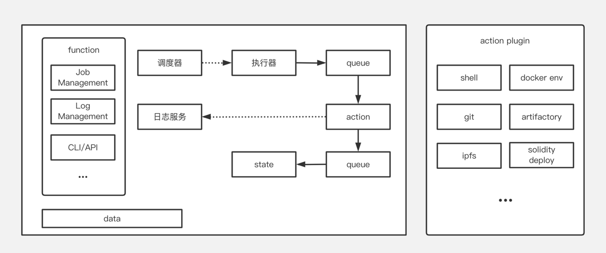

## 基本资料

项目名称：ALine

项目立项日期 (哪年哪月)：2022.11

## 项目整体简介
- 项目背景/原由/要解决的问题 (如有其他附件，可放到 `docs` 目录内。英文提交)。
  - 背景
  - With the development of Web3, more and more people are focusing on the world of web3. There are also many developers involved in the development of web3.
  - (随着Web3的发展，越来越多的人聚焦到web3的世界。也有很多的开发者参与了web3的研发)
  - 原由
  - With more and more blockchain applications, web3 projects are getting more and more complex and engineering. There are many repetitive operations for developers to perform R&D, such as contract deployment, Dapp remote deployment, etc. There are also human error mistakes, such as pGALA events, private keys leaked on github.
  - (随着区块链应用的越来越多，Web3的项目也越来越复杂和工程化，开发者在进行研发的过程中有很多重复的操作，例如合约部署，Dapp远程部署等，也会有人为失误错误，例如pGALA 事件，私钥在github上泄露)
  - 要解决的问题
  - Reduce the duplication of developer workload and simplify the development threshold for developers
  - (降低开发者的重复工作量，简化开发者的开发门槛)
  - Allow developers to deploy and publish Dapp contracts through simple operations and provide a user-friendly interface to speed up developers' development
  - (让开发者通过简单的操作进行Dapp的部署与合约的发布，并提供友好的界面来加速开发者的研发速度)
- 项目介绍
  - 一个自动化的智能合约/Dapp的部署区块链工具包。开发者可以根据自己的需求选取相应的功能（检出/合约检查/.../部署）配置自己的pipeline，并链接远程链，最终实现一键将自己开发的合约部署到想要部署的链上。
- 项目Demo
- 技术架构  
  
- 项目 logo (如有)，这 logo 会印制在文宣，会场海报或贴子上。
- 

## 黑客松期间计划完成的事项
- 开发者CICD流程工具，可以进行本地的合约部署流程和Dapp部署流程
- 完成pipeline核心结构，可以在本地进行pipeline的整体功能，我们可以基于pipeline进行快速优化开发流程，进行自动化部署合约和自动发版等流程。
    - Pipeline Engine
      - CLI
      - Stage Analysis
      - Step Execution
      - 执行记录
      - Pipelie Workflow
      - Log View
      - Step Plugin
          - Shell
          - Docker Env
    - Pipeline Create
        - Create
        - Process Configuration
    - Pipeline List
    - Pipeline Details
        - Excution History List
        - Execution Process
        - Execution Report
        - Artifacts
    - Set Pipeline
        - Process Configuration
        - Trigger Rule : Manual trigger
- 添加关于Constract和Dapp的部署Step插件。可以提供给开发者进行自动构建和合约部署等功能。
    - Pipeline Create
        - Choose Template
        - Template Definition
    - Step Plugin
        - Git Clone
        - Contract Code Check
        - Contract Code Compile
        - Contract Code Deploy
        - Contract Developer Environment
        - Node.js Code Check
        - Node.js Code Build
        - Node.js Code Deploy

## 黑客松期间所完成的事项 (12月27日初审前提交)

- 12月27日，在本栏列出黑客松期间最终完成的功能点。
- 把相关代码放在 `src` 目录里，并在本栏列出在黑客松期间打完成的开发工作/功能点。我们将对这些目录/档案作重点技术评审。
- 放一段不长于 **5 分钟** 的产品 DEMO 展示视频, 命名为 `团队目录/docs/demo.mp4`。初审时这视频是可选，demo day 这是计分项。

## 队员信息
（包含参赛者名称及介绍/在团队中担任的角色/GitHub 帐号/微信账号（如有请留下，方便及时联系））  
- 梁腾 项目负责人 https://github.com/ltmuyuan
- 莫海江 技术架构工程师 https://github.com/mohaijiang
- 张翔 产品经理 
- 孙建国 全栈开发工程师 https://github.com/jian-guo-s
- 叶巧钰 前端开发工程师 https://github.com/yuliaye
- 郭智浩 链开发工程师 https://github.com/CoderfishGzh
- 姜志辉 后端开发工程师 https://github.com/jlvihv
- 王炳鉴 后端开发工程师 https://github.com/abing258/