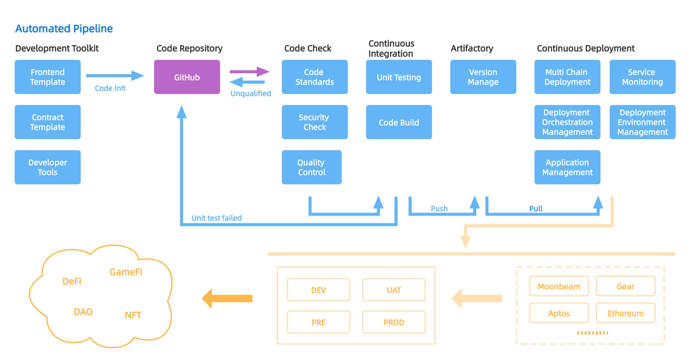

# 项目

项目名称：ALine

开始时间：2022.11

# 介绍

在本次黑客马拉松中，我们选择了以下赛道:
- 区块链工具
- Bounty-Gear-为gear开发一个基础设施和工具

## 项目背景
当前：
1，随着Web3的发展，越来越多的人开始关注web3的发展，也有越来越多的开发者参与到web3的开发中来。
2，随着越来越多的dapp出现及更迭，web3 项目正在变得越来越复杂和工程化。开发过程变得门槛越来越高，且开发者有很多重复性的操作，比如合约部署，DApp远程部署等。
3，Web3分支体系变得异常庞大，但又紧密相关，比如合约的开发者离不开公链开发者的帮助，链开发者也离不开网络的帮助等。
4，频繁的部署会产生大量机械性动作，此时人为操作就难免会产生失误，进而带来巨大的安全隐患，且产生巨额的损失，比如pGALA事件，github上的私钥泄露等。

在此大背景下， 我们看到很多单点的开发者工具在最近两年不断涌现，来协助开发者完成Web3.0项目的开发工作。但与此同时，目前市面上缺乏成体系，为整体的开发及运维流程提供整合，一站式解决方案的优秀产品。
在完成对全球49支（截止2022年12月10号，含波卡生态15支）不同生态，不同赛道的项目团队综合调研后，我们发现此类工具是必要的，可以降低成本的，且有广泛应用空间的。

由此，ALine项目诞生。

## 项目介绍

ALine 是 Web3.0 中的一站式开发及运维工具集 DevOps 平台。ALine 致力于通过让 Web3.0 开发者/开发团队构建可定制的 Pipeline，实现高度自动化的开发及运维流程，包括提供多链合约模板、代码/合约质量及安全检查、合约部署、节点服务以及持续集成/持续部署（CI/CD）等，进而大幅提高起开发效率。
ALine 支持多个生态及合约开发语言，集成基于 ink! 及 gear 的多个合约模板，并支持波卡生态内项目的开发及运维工作。

## 项目细节

ALine以SaaS的模式提供服务，通过ALine，用户可以得到从创建项目，开发项目，到项目运维的全方位，流程化，智能化的助力，提升其约30%-40%的开发效率，节约开发成本。
项目集成了波卡生态用到的合约模板，对其前端代码及合约代码能够进行代码质量检查，安全检查，同时对波卡生态的合约部署提供全面支持。

她的具体产品特性包括：
- 提供所需的业务（合约）模板
- 代码安全及质量检查
- 快速部署
- 数字化监控
- 智能化运维
- 支持团队协同工作
- 支持研发流水线Pipeline的定制
- 自动化任务流（Pipeline自动触发）
- 开发者工具集成

通过ALine，开发者/开发团队可以实现的业务场景包括：

- 通过模板可以快速帮助开发者创建不同生态的 DApp 项目
- 对智能合约进行代码质量检查和代码安全检查并可以查看报告信息
- 快速部署DApp
- 在页面上完成合约的交易
- 查看部署合约的交易信息
- 定制化开发流水线
- 查看其所部署的服务的运维信息
- 随时知道相应的服务状态和健康警告
- 在页面上快速集成流行的开发工具以加速开发

### 项目流程图

  

### 技术方案

为了实现我们的产品愿景，我们采用前后端分离完成我们的项目，设计方式采用 DDD （Domain-driven Design）领域模型设计。
初版技术图如下：

  

- User Interface  
  用户接口层，为用户/调用方提供可访问的接口，我们简称为 UI 层，这里我们将前端的界面也归纳到UI层中，前端我们采用 Vue + Ant Design + Vite 方式进行构建。除了前端，我们会将 DTO 和 Controller 也作为归入 UI 层
- Application Layer  
  应用层是整体的应用功能的规划，根据业务需要衍生出多项服务，包含开发者工具服务，项目管理服务，运维管理服务。
    - Development Tools：开发者工具是为了帮助开发人员更好的完成项目的工具集合，其中包括业务模板，业务模版有合约模板和前端模板，合约模板为主流的赛道提供不同的模板，如 NFT，DeFi，GameFi，DAO 等场景下，提供 Solidity，Ink！，Move 等不同生态的合约模板，我们目前收集市面上主流的开源合约并进行完善和添加。后续我们构建成合约模板生态让开发者们都可以在这里提供好用的合约开发模板。前端模板集成当下可用的前端框架，如 Vue、React、nuxt.js 等，也在其之上添加通用的组件例如钱包组件，有效提高开发效率。开发者工具为当下通用的开发组件集合，例如钱包组件，合约 ABI 接口转换等工具，也作为开放型的平台鼓励大家进行组件上传和使用。
    - Project Manage：项目管理提供通过业务模板创建项目，并将代码直接下载到开发者的 Github 仓库中，并提供合约与前端的安全检查和构建，以及生成构建库管理，开发者只需要专注研发自身业务的代码，将代码提交到 Github 中，项目管理会自动对合约代码进行健康检查并完成代码的构建生成 abi 元数据存储到 Artifactory 中，并进行版本管理。开发者还可以通过定制化工作流，优化自己项目的研发过程。
    - OPS Manage：运维管理提供快速部署，合约操作，以及服务运维功能。可以从制品库中将合约进行一键部署，在部署后生成合约操作页面，可以在线上直接进行合约的操作，并可以查看合约的实时交易数据。对于前端服务也可以进行一键部署的功能，快速让前端部署到可用资源中，并提供可访问地址，同时，支持进行版本回滚，服务状态监控等功能。
- Domain Layer  
  领域层是表达业务概念，业务状态信息以及业务规则，领域模型处于这一层，是业务软件的核心。
    - Core：指的是这个业务的核心功能，核心模块。其中Template为模板创建功能，可以添加并生成模板，Pipeline是构建研发流水线的自动化执行工具，可以通过流程配置完成不同的自动化工作，如自动构建，自动部署等。Workflow 是基于 Pipeline 的最佳实践功能集合，例如构建代码安全检查功能，并且可以定制不同开发场景的自动化工作流场景。Deployment 负责部署服务核心功能，包括合约部署管理，前端部署管理，部署调度和部署版本等功能。
    - Supporting：支持核心业务功能域。Artifactory是基于研发过程中的中间产物管理，例如二进制构建包的管理、代码检查报告管理、应用景象管理等。Monitor是对部署服务的资源进行监控和告警，当部署的服务出现异常情况可以及时进行通知告警。Project 是项目管理模块支持开发者的研发过程的支持。Developer Tools 是通用的开发组件集合管理功能。
    - Generic：同时被多个子域使用的通用功能子域是通用域。Authentication 基于 Github 进行用户认证，用户只需要有 Github 账户就可以登陆系统。Authority 权限授权，授予产品 github 的 push 权限，可以直接将代码模板推送到用户的 github 仓库中，以及提供系统内的权限管理功能。
- Infrastructure Layer  
  提供公共服务组件
    - Data Assembler：数据转换器
    - Repository：提供查找和检索持久化对象并封装的基础设施
    - Gateway：提供给 User Interface 的网关服务组件
    - Exception：提供公共的异常处理逻辑
    - Config：系统的配置文件管理功能

### 功能列表

目前定义的V1版本所包含的具体功能有

- 模板
    - 模板创建
    - 模板列表
    - 模板详情
- 项目
    - 基于模板创建项目
    - 生成合约检查工作流
    - 生成合约构建工作流
    - 生成前端代码检查工作流
    - 生成前端代码构建工作流
    - 制品库管理
    - 检查报告管理
- 部署
    - 合约部署
    - 前端部署
    - 合约交易
    - 合约数据查询
    - 部署版本管理
    - 域名管理

## 黑客松期间计划完成的事项

我们整体产品功能实现相对复杂，目前做了模板添加和快速部署方面的应用场景作为参赛作品，并且提供可操作的界面，并对其中的引擎进行开源，我们计划完成的功能包括：

- 构建 Pipeline 引擎，可以通过配置文件完成自动化流水线执行，并提供日志查看
- 基于 Pipeline 引擎完成智能合约的自动部署和前端的自动部署功能
- 提供前端页面进行可视化操作

### ui 展示

<https://www.figma.com/file/bSiQuWzdHoeSjHn6EZO0ah/ALine?node-id=0%3A1&t=7b7O3nlECA0DF8FE-0>

## 黑客松期间的成果

其中我们上述功能完成的具体实现列表为：

- Ink！合约自动化部署模板
- Gear 合约自动化部署模板
- Solidity 合约自动化部署模板
- Pilepine
    - Pipeline Engine
        - CLI
        - Stage Analysis
        - Step Execution
        - Pipeline Exec Record
        - Pipelie Workflow
        - Log View
        - Step Plugin
            - Shell
            - Docker Env
    - Pipeline Create
        - Create
        - Process Configuration
    - Pipeline List
    - Pipeline Details
        - Excution History List
        - Execution Process
        - Execution Report
        - Artifacts
    - Set Pipeline
        - Process Configuration
        - Trigger Rule : Manual trigger
- 前端页面
    - Pipeline Create
    - Pipeline Editor
    - Pipeline List
    - Pipeline History List
    - Pipeline Execution Process
    - Pipeline Execution Log

### Demo 视频

## 队员信息
队长: Abing  
- 在大型科技公司有6年的软件开发实践经验

Liam - 技术主管
- 4年以上的加密货币工作经验。
- 8年以上java/Go/Rust和Solidity DApps、DevOps和云计算方面的软件编码经验。
- https://www.linkedin.com/in/liam-liang-092950245/

Tom- 开发团队的负责人
- 超过9年的软件开发经验
- 熟悉Go/Rust/Java/Python/JavaScript/Typescript，云计算，云原生，和DevOps。

Linda-PM
- 哈斯顿大学的CS学士学位
- 5年产品管理经验，包括2年区块链行业经验

Alvis- 运营和业务发展
- 斯图加特大学、加州大学伯克利分校和图里巴大学的经济学和管理学博士及CS硕士。
- 曾是Web3Go（Litentry）的联合创始人。
- 曾任Asto-Telematics（德国）亚太区总裁。
- https://www.linkedin.com/in/alvis-tsui-69952341/

Nova - 金融与市场
- 几个加密货币基金的LP。
- 毕业于上海交通大学。
- https://www.linkedin.com/in/nova-wong-92b48359/

开发团队: 
建国
志辉
巧钰
智浩
泽汛
