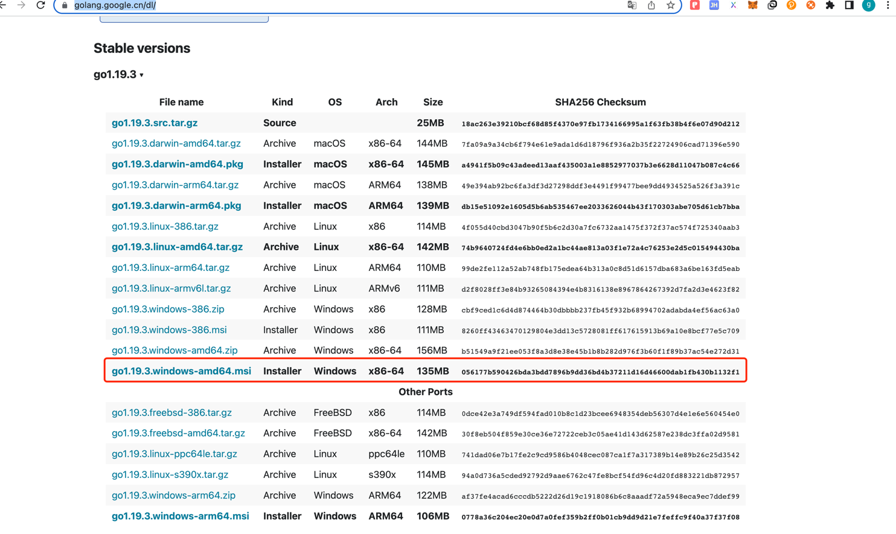
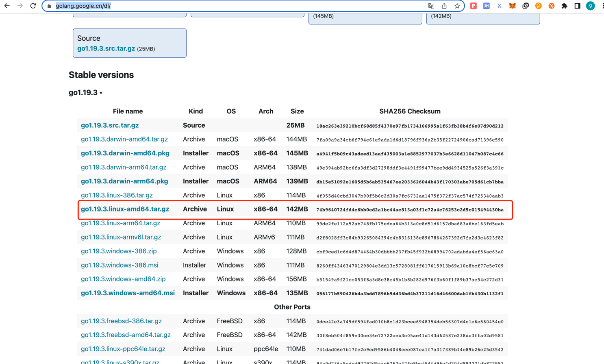
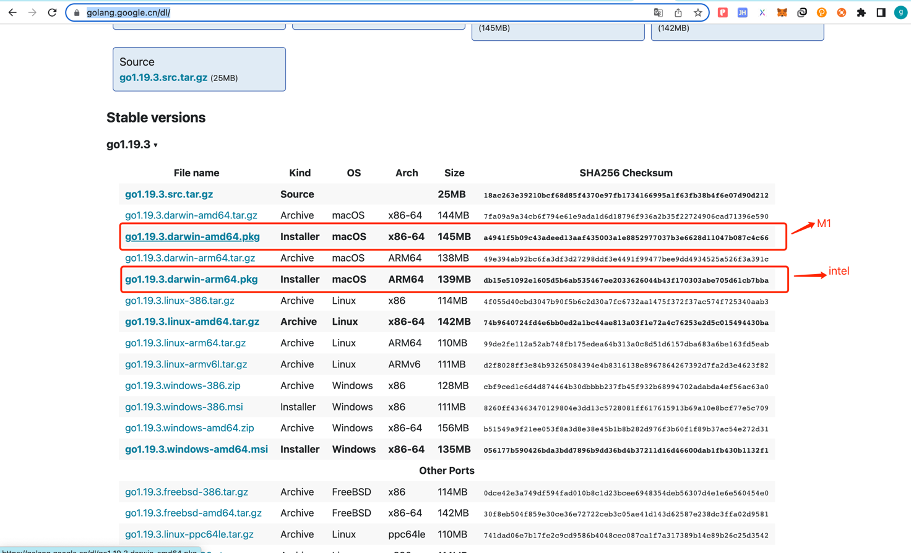
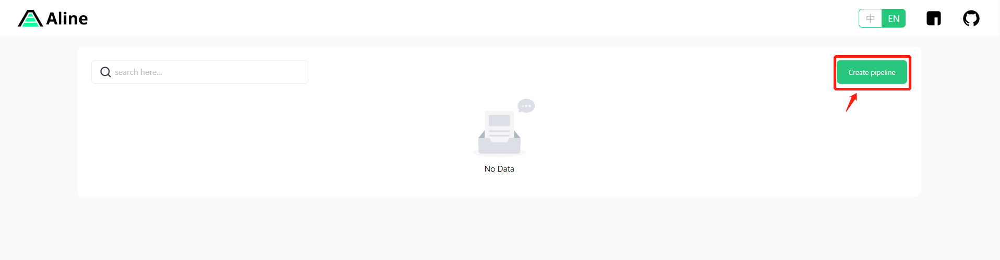
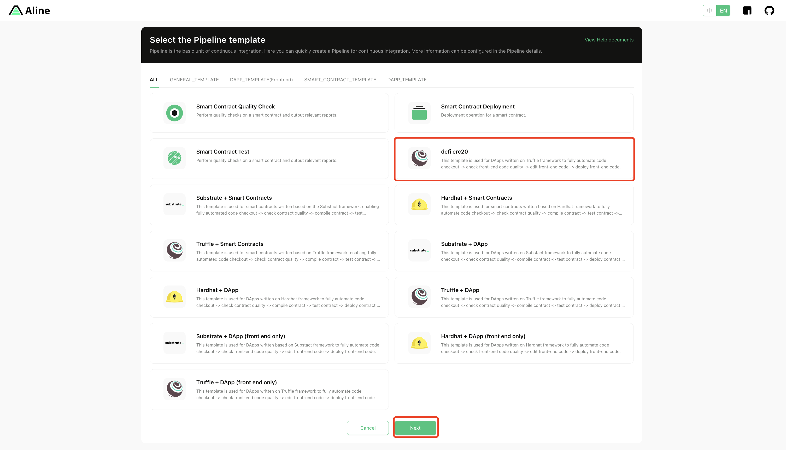
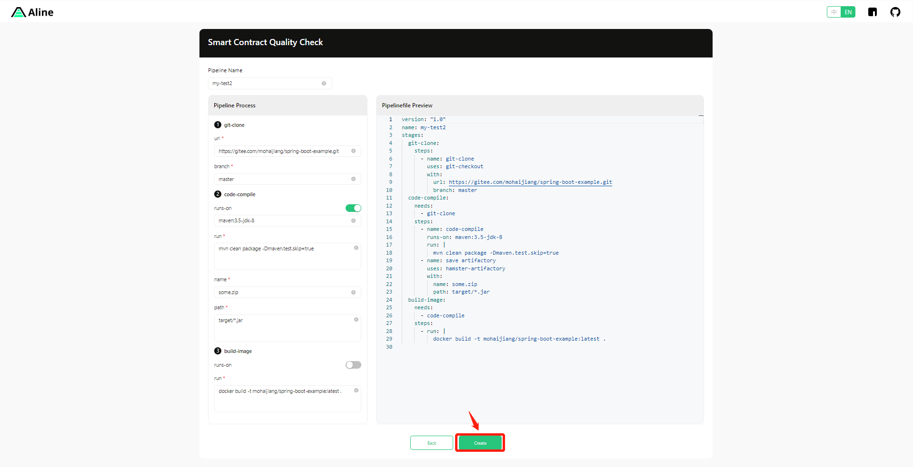
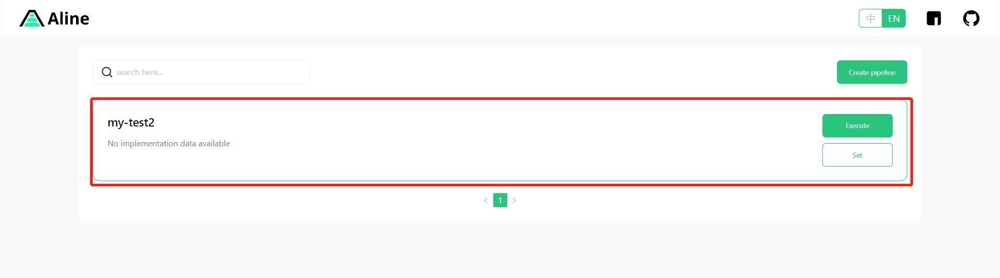
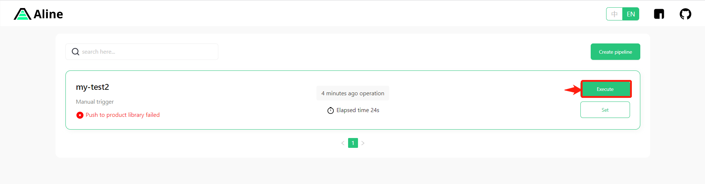
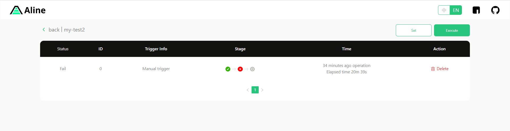

<div align="center">

</div>

<div align="center">


</div>

[https://github.com/hamster-shared/a-line/tree/develop](https://vvbin.cn/next/)

This template should help get you started developing with Vue 3 in Vite.

## Recommended IDE Setup

[VSCode](https://code.visualstudio.com/) + [Volar](https://marketplace.visualstudio.com/items?itemName=Vue.volar) (and disable Vetur) + [TypeScript Vue Plugin (Volar)](https://marketplace.visualstudio.com/items?itemName=Vue.vscode-typescript-vue-plugin).

## Type Support for `.vue` Imports in TS

TypeScript cannot handle type information for `.vue` imports by default, so we replace the `tsc` CLI with `vue-tsc` for type checking. In editors, we need [TypeScript Vue Plugin (Volar)](https://marketplace.visualstudio.com/items?itemName=Vue.vscode-typescript-vue-plugin) to make the TypeScript language service aware of `.vue` types.

If the standalone TypeScript plugin doesn't feel fast enough to you, Volar has also implemented a [Take Over Mode](https://github.com/johnsoncodehk/volar/discussions/471#discussioncomment-1361669) that is more performant. You can enable it by the following steps:

1. Disable the built-in TypeScript Extension
   1. Run `Extensions: Show Built-in Extensions` from VSCode's command palette
   2. Find `TypeScript and JavaScript Language Features`, right click and select `Disable (Workspace)`
2. Reload the VSCode window by running `Developer: Reload Window` from the command palette.

## Customize configuration

See [Vite Configuration Reference](https://vitejs.dev/config/).

## Project Setup

```sh
yarn install
```

### Compile and Hot-Reload for Development

```sh
yarn dev
```

### Type-Check, Compile and Minify for Production

```sh
yarn build
```

### Contributors

Thank you for considering your contribution to ALine!

<a href="https://github.com/hamster-shared/a-line/graphs/contributors">
  
</a>

---

<br>

# 概述

欢迎使用 ALine 文档！以下指南将帮助您指导您完成构建去中心化应用程序的旅程。如果您在使用 ALine 时遇到任何问题，或者发现此处描述的内容不明确，请在 GitHub 上提出问题。

后端使用了 `go` 语言开发。

前端使用了最新的 `vue3`, `vite3`, `Typescript`, `Ant Design Vue3`, 等主流技术开发。

## 什么是 ALine？

## 安装

### 先决条件

本地需要安装 go 环境

- windows 安装 go 环境

  1. 访问[Downloads](https://golang.google.cn/dl/)
  2. 下载安装包并执行安装

     

  3. 配置 go 代理

  ```shell
  #配置代理
   go env -w GOPROXY=https://goproxy.cn,direct
   go env -w GO111MODULE=on
  ```

- linux 安装 go 环境

  1. 访问官网[下载地址](https://golang.org/dl/)

  2. 下载对应系统安装包

     

  3. 将下载的压缩包解压，移动到/usr/local/目录下
  4. 配置环境变量

  ```shell
   vim ~/.bash_profile
  ```

  在文件最后加入以下内容

  ```shell
   # $HOME/go 为工作空间的路径,可自行修改
   export GOPATH=$HOME/go
  ```

  更新配置

  ```shell
  source ~/.bash_profile
  ```

  1. 配置 go 代理

  ```shell
  #配置代理
   go env -w GOPROXY=https://goproxy.cn,direct
   go env -w GO111MODULE=on
  ```

- macos 安装 go 环境

  1. 访问官网[下载地址](https://golang.org/dl/)

  2. 下载对应系统安装包并且安装

     

  3. 配置 go 代理

  ```shell
  #配置代理
   go env -w GOPROXY=https://goproxy.cn,direct
   go env -w GO111MODULE=on
  ```

### 安装 ALine(目前只支持 Macos,Linux)

源码安装

- 从远程仓库 clone 代码到本地

```shell
 git clone -b develop https://github.com/hamster-shared/a-line.git
```

- 编译构建

```shell
 cd a-line   //进入到项目目录
 make web    //编译构建前端
 #此处更具操作系统执行不同的命令
 # linux执行
 make linux
 # macos执行
 make macos
```

### 启动 ALine

安装 ALine 成功后，在项目目录下执行以下命令

```shell
 ./aline daemon   #启动ALine
```

## 快速创建部署 DApp

- 从模板创建

  1.  点击创建按钮，进入创建界面

      

  2.  在创建页面，选择想要的模板，点击下一步按钮

      

  3.  进入信息面板，确认信息无误，点击下一步创建按钮

      

  4.  成功创建后，在首页即可看到您所创建的 Pipeline

      

- 应用结构
- 运行 Pipeline：点击运行按钮即可运行

  

- 查看运行结果

  1.  点击卡片进入

      

  2.  此页面展示了具体的运行流程及结果

      

- 通过 CLI 运行 Pipeline: 在终端运行此代码即可
  ```sh
  ./pkg/service/template/templates/erc20.yml
  ```
