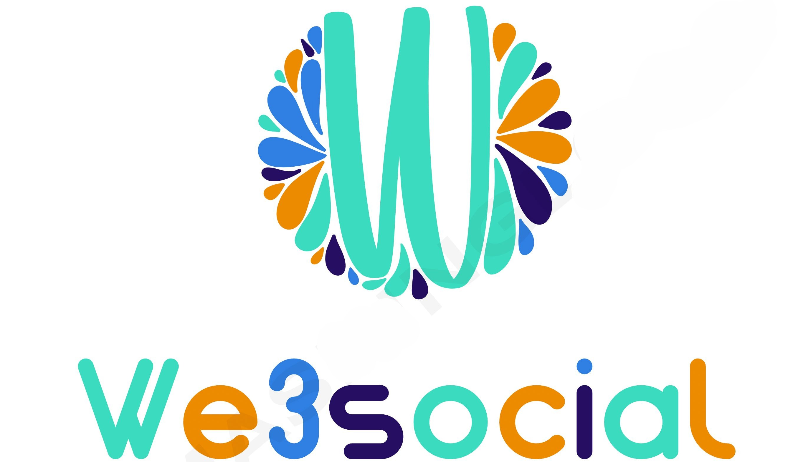
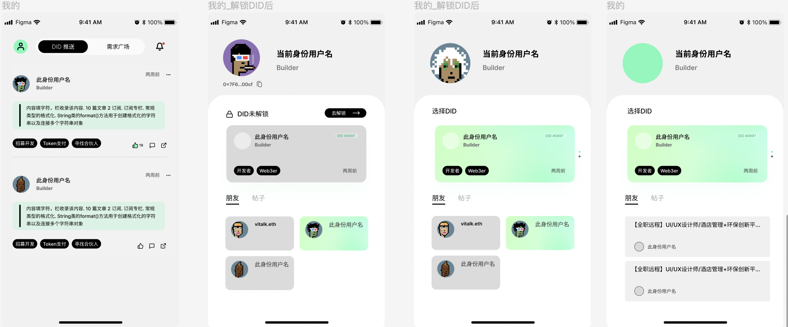

## basic information

project name：We3social

Project start date：2022/10/31

## Project

We3social is a multi-chain DID social project built on moonbeam. It is the infrastructure for Web3 talent identity data socialization, and is dedicated to solving point-to-point connections. In the process from web2 to web3, there is a problem that is ignored by everyone. Blockchain encryption belongs to a small number of circles. At the same time, there are high barriers to information transmission in users' social interaction, and they do not know each other and are not interested. Based on privacy computing and AI recommendation system, We3social intelligently pushes user social interaction according to user needs. Form a new social behavior paradigm driven by AI interest data. For example, an encryption enthusiast wants to release a new project, a college student wants to make friends and learn solidity, an investor wants to find a suitable developer, and a community KOL wants to get more fans, We3social can intelligently push data for them, and behavior Mode interaction data is only visible point-to-point, so there is no need to worry about any privacy leaks.

## Project details
A reasonable balance between on-chain and off-chain is an important part of Web3 applications. This MD document will mainly explain the whole project from the on-chain and off-chain. On the chain is the DID smart contract deployed on Moonbeam, and off the chain is the necessary basic web application to run We3social. During the Hackthon, the contract on the chain is the smallest functional unit completed.

**On-Chain DID设计architecture**

Layer 1: Proxy layer, which delegates contract calls to the protocol layer. The advantage of using a proxy is that the contract can be upgraded, and the contract address of the user entry remains unchanged.

Layer 2: Protocol layer (logic layer), this layer implements W3C's DID protocol, and the logic can be changed. Do not store your own state variables, only use Layer 3 storage to avoid storage conflicts after upgrade.

Layer 3: Data storage layer, using iterable map to store data. The data storage format is bytes

Contract upgrade: Since the data and protocol are separated, when there is an upgrade need, just modify the Layer 2 contract directly. The data storage form of Layer 3 is directly the K-V structure, which has nothing to do with the protocol, so there is no modification during the upgrade.

**Off-chain architecture**

The We3social off-chain system adopts a distributed micro-service architecture to ensure the stability and reliability of the entire system. The development language is mainly based on the modularization of the RUST+JAVA interface to handle various types of things. On the data level, Mysql+redis is used to ensure data persistence and high concurrency scenarios. The whole system has four modules, recommendation system, user system, network toolbox, and function module. The whole system is componentized and can be replaced dynamically according to the needs at any time.

## User interface details：
React will be used in the front UI. This will be the entry point for users to use the entire functionality. Our simulation is shown below.
The figma address (https://www.figma.com/file/Vlj722FwD01NUAnxopys3W/Brief_9_18?node-id=79%3A1226)

## Items completed during the hackathon (submitted before the first review on December 27, 2022)

**On-Chain: Contracts**

- `SimpleDID`
   - [x] Deploy the Moonbeam contract (`deploy`)
   - [x] On-chain DID identity beta registration (`fn mint()`)

**Off-Chain**
- [x] We3social DAPP front-end application
- [x] Java main server node
- [x] Rust microservice nodes

**web Dapp side (react)**
   - [x] Login Register
   - [x] Soul Binding Questionnaire System
   - [x] DID information browsing
   - [x] Moonbeam contract interaction
   - [x] Request updates and posts
   - [x] Settings and User Agreement

**We3social Java Backend (Master Node)**
   - [x] Login Register
   - [x] Email verification code function
   - [x] dynamic push
   - [x] microservice forwarding
   - [x] Redis high concurrency and Mysql database initialization
   - [x] Backend API interface

**DID-Server Rust Backend (Distributed Function Node)**
   - [x] DID push
   - [x] Push messages
   - [x] Friends list
   - [x] Initialization of Mysql database
   - [x] test modules

## The goal of the next stage

- 1. Build a multi-chain DID digital identity wallet application
- 2. Obtain blockchain cooperation with more than 10 communities
- 3. Develop Android and IOS applications based on Flutter
- 4. Refactor DID smart contract

## See more:

- Dapp Demo Online,Please open it in your mobile wallet(http://dapp.w3social.chat) --｜TestAccount  123@qq.com｜password 123456｜ 

- We3social offical website (http://www.w3social.chat)

- API document （https://docs.qq.com/doc/DRG9wdll4UlFlckJt）

## Team

|Name|Function|GitHub|Twitter|
|---------|---------|---------|---------|
|DengLiangjun|Rust|https://github.com/peter-jim||
|Liulei|operation||
|Dingyulong|JAVA|https://github.com/ed-stan||
|Konglili|React|https://github.com/AutumnDeSea||
|Tanxuan|React|https://github.com/Sihan-Tan||
|Lanqiao|UI/UX|||
