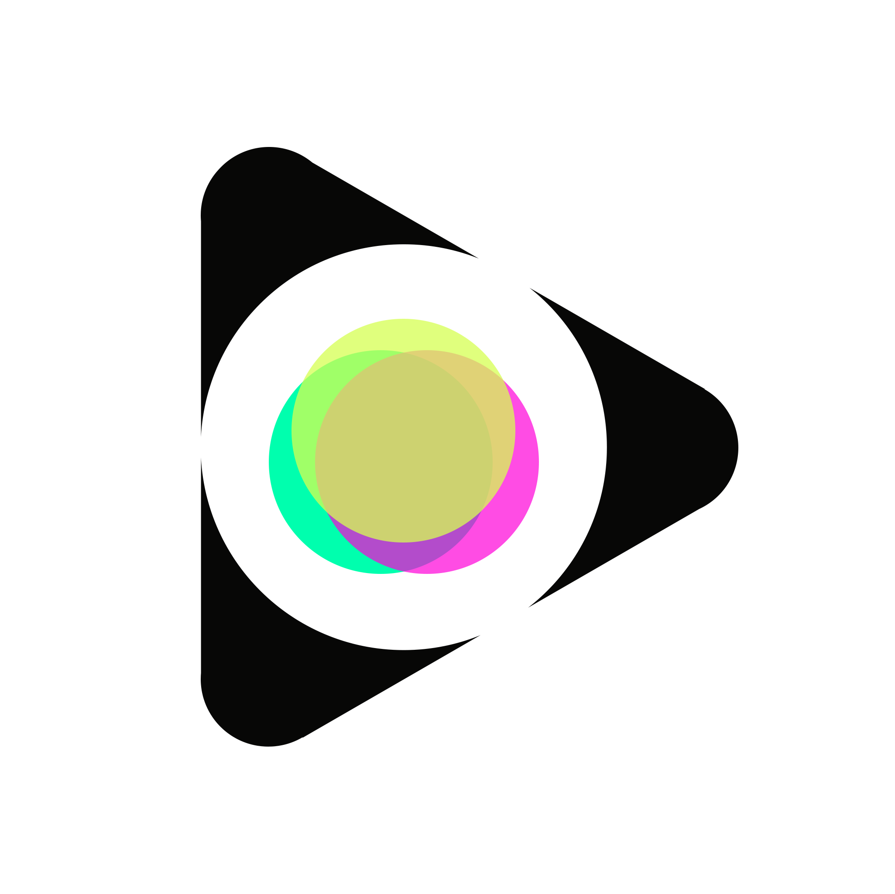

# 基本资料

项目名称：VIDEOWN

项目立项日期：2022.11

## 项目整体简介 &nbsp;&nbsp;&nbsp;&nbsp;👉[videown演示视频](http://13.212.109.154/play/9854db7502bf5c69af6a1890f440f71f1c3700637f918c116f702d270f16c20a)

### 项目背景

在web3领域，我们常常讨论创作者经济如何更好地为创作者服务。然而在当下，web3世界中被创造的事物，难以真正地被创作者所拥有。被创造的数据，依然面临中心化存储的困境。诚然，越来越多的项目看到了这一点，开始使用去中心化存储。但由于存储基础设施仍不完善，导致了应用的表现不尽如人意。

### 项目介绍
VIDEOWN是一个去中心化视频NFT平台，它建立在CESS区块链上，支持良好体验的视频流媒体播放。用户可以在VIDEOWN上传、播放或查找所有标签的视频内容，也可以将内容铸造为NFT。同时，基于CESS区块链，NFT不再是仅仅以智能合约的方式实现，VIDEOWN将实现数据本身就是NFT，用户之间可以交换数据所有权，无论是图片、音乐还是视频。

### 技术架构
React.js、Polkadot.js、antd UI、golang、cess-sdk-go

详细内容请查看 [videown技术架构](./docs/videown技术架构.md)；

### Demo展示

1. 操作教程，请参见 [videown操作教程](./docs/videown操作教程.md)；
2. 演示视频，请参见 [videown演示视频](http://13.212.109.154/play/9854db7502bf5c69af6a1890f440f71f1c3700637f918c116f702d270f16c20a)；

## 黑客松期间计划完成的事项

详细内容请查看 [videown开发计划](./docs/videown技术架构.md#黑客松期间计划完成事项)；

## 黑客松期间所完成的事项 (2022 年 12 月 27 日初审前提交)

我们团队已经顺利完成了开发计划的全部内容，详细内容请查看 [实际完成的工作](./docs/videown技术架构.md#黑客松期间计划完成事项)；

## 队员信息

| Name     | Role     | Email                                                        | Wechat            |
| -------- | -------- | ------------------------------------------------------------ | ----------------- |
| Luke     | 全栈开发 | [videown2023@gmail.com](mailto:videown2023@gmail.com)        | meiguofuwuqichuzu |
| Mar      | 前端开发 | [shuiguowuhen8@gmail.com](mailto:shuiguowuhen8@gmail.com)    | Videown           |
| Tony Dai | 合约开发 | [waterbrother2022@gmail.com](mailto:waterbrother2022@gmail.com) | o98k              |
| Young    | 运营     | [onway.yang@gmail.com](mailto:onway.yang@gmail.com)          | onway518          |
| Han      | 产品     | [xuhamid@outlook.com](mailto:xuhamid@outlook.com)            | LeeXuHam          |
