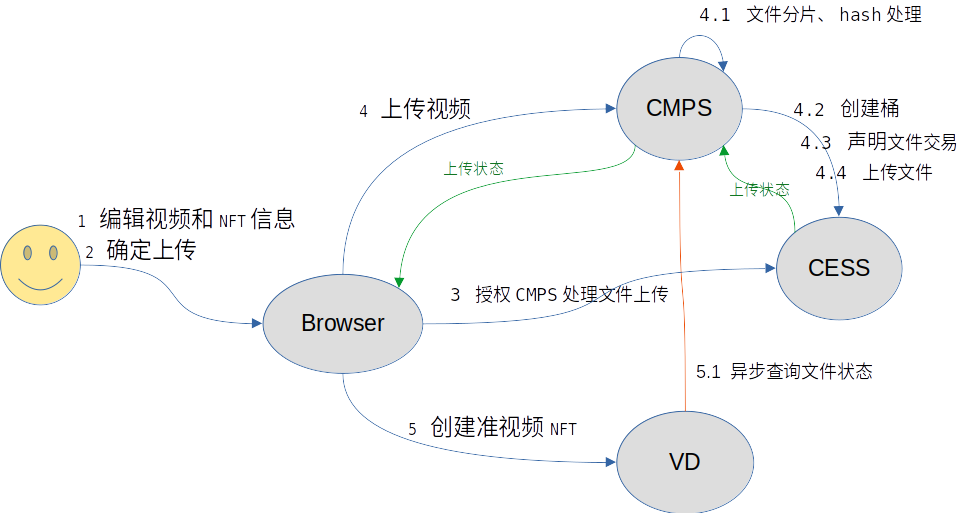
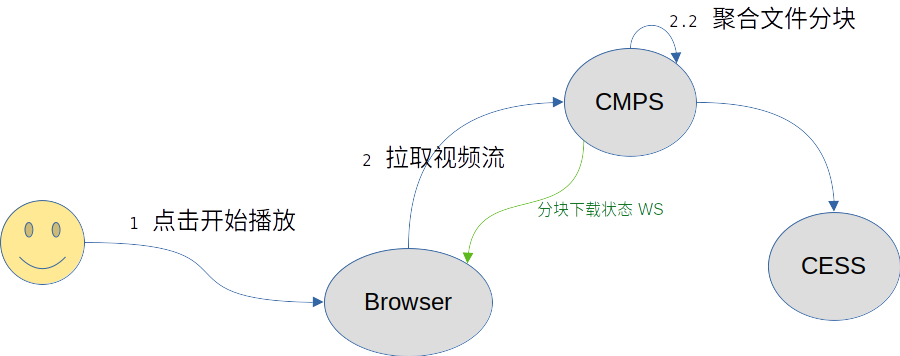
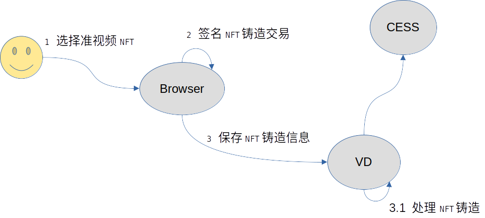
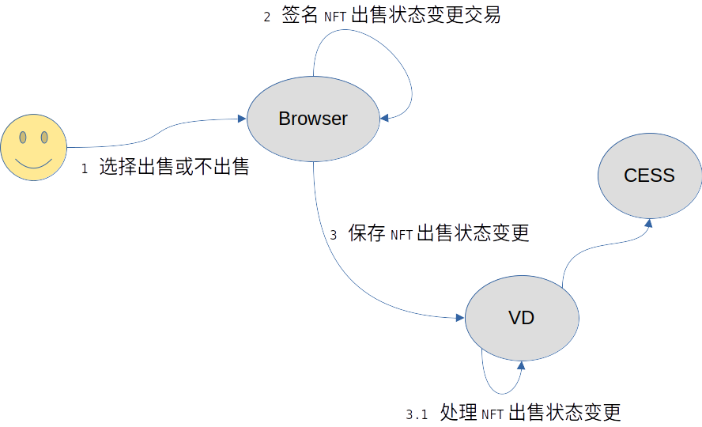
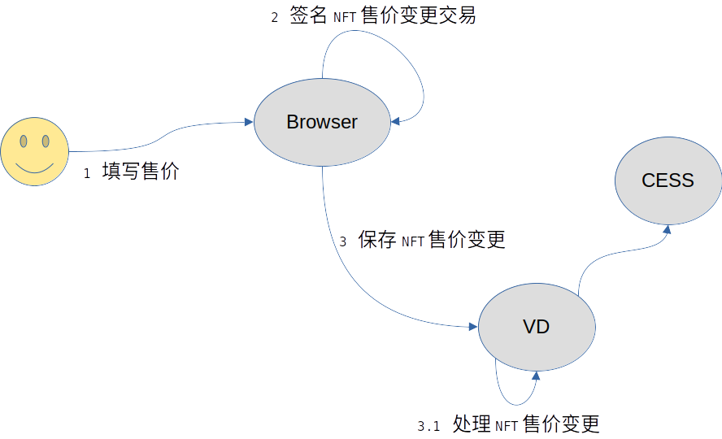
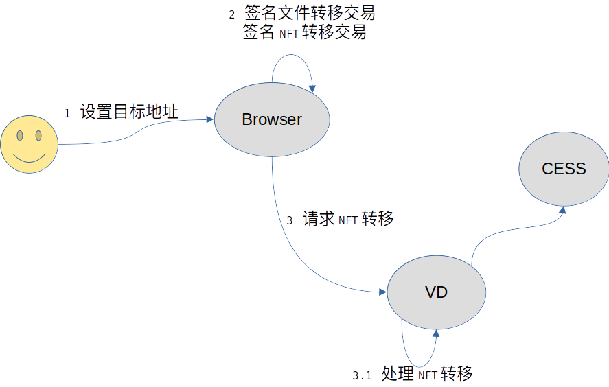
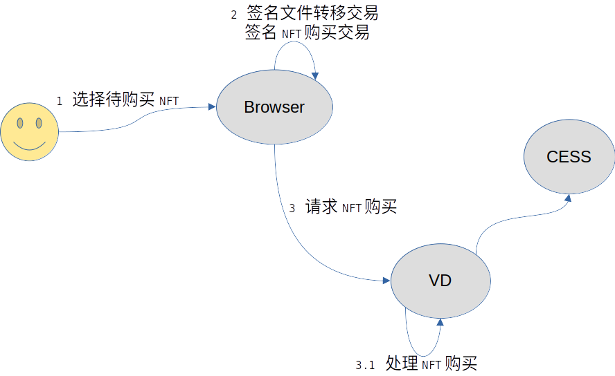

# VIDEOWN Technology Architecture

## Main Frame Diagram

## Business Interaction Diagram

> **Glossary:**
>
> VD：VIDEOWN.
>
> CMPS： CESS Media Proxy Server.
>
> CESS： Cumulus Encrypted Storage System,a decentralized storage network.

### **Video Upload Interaction Diagram**

1. Edit the video and NFT information

2. Confirm upload

3. Authorize CMPS to handle file upload

4. Upload video

   4.1 Slicing file, and creating hash

   4.2 Create bucket

   4.3 File transaction statement

   4.4 Upload file
5. Create video NFT
   5.1Asynchronous file status query

### **Interactive Diagram When Video NFT Plays**

1. Start playing video

2. Pulling video stream

   2.2 Aggregate file segments

Green arrow:file segments download status ws

### **Minting Video NFT Interactive Diagram**

1. Select video

2. Sign for the NFT minting transaction

3. Save the NFT minting information

   3.1 Process NFT minting

### **Interactive Diagram When Setting NFT Its On/Off Sale Status**

1. Choose to sell or not to sell

2. Sign for the NFT selling status changing transaction

3. Save NFT selling status

   3.1 Process NFT selling statues changes

### **Set the NFT Selling Price Interaction Diagram**

1. Set selling price

2. Signify NFT selling price transaction

3. Save NFT selling price changes

   3.1 Process NFT selling price changes

### **NFT Transfer Interaction Diagram**

1. Set the address

2. Signed file transfer transactions and sign NFT transfer transaction

3. NFT transfer request

   3.1 Process NFT transfer

### **Video NFT Purchase Interactive Diagram**

1. Select NFT to purchase

2. Signed file transfer transactions and Sign NFT transfer transaction

3. Request to purchase NFT

   3.1 Process NFT purchase

## Items planned to be completed during hackathon

<table class="ne-table" style="width: 700px;"><colgroup><col width="200"><col width="250"><col width="249"></colgroup><tbody class="ne-table-inner"><tr class="ne-tr"><td class="ne-td" data-col="0" style="background-color: rgb(239, 240, 240);">
<ne-p id="u7ef32e3c" data-lake-id="u7ef32e3c" ne-alignment="center"><ne-text id="ue3e9b861" ne-bold="true">Project</ne-text> </ne-p>

</td><td class="ne-td" data-col="1" style="background-color: rgb(239, 240, 240);">
<ne-p id="uc100ed10" data-lake-id="uc100ed10" ne-alignment="center"><ne-text id="u30ccf855" ne-bold="true">Function</ne-text> </ne-p>

</td><td class="ne-td" data-col="2" style="background-color: rgb(239, 240, 240);">
<ne-p id="uc97eff34" data-lake-id="uc97eff34" ne-alignment="center"><ne-text id="u62b7a3e9" ne-bold="true">Explain</ne-text> </ne-p>

</td></tr><tr class="ne-tr"><td class="ne-td" rowspan="12" data-col="0" style="vertical-align: middle;">
<ne-p id="ucd4de16c" data-lake-id="ucd4de16c" ne-alignment="center"><ne-text id="u55d08e4b">videown-web</ne-text> </ne-p>

</td><td class="ne-td" data-col="1">
<ne-p id="u800357ec" data-lake-id="u800357ec"><ne-text id="uda50b542">homepage</ne-text> </ne-p>

</td><td class="ne-td" data-col="2">

</td></tr><tr class="ne-tr"><td class="ne-td" data-col="1">
<ne-p id="ud827fd63" data-lake-id="ud827fd63"><ne-text id="u16a454fc">Wallet connection and account list</ne-text> </ne-p>

</td><td class="ne-td" data-col="2">

</td></tr><tr class="ne-tr"><td class="ne-td" data-col="1">
<ne-p id="u3a4d5cdf" data-lake-id="u3a4d5cdf"><ne-text id="udf62bdce">Transaction signature</ne-text> </ne-p>

</td><td class="ne-td" data-col="2">

</td></tr><tr class="ne-tr"><td class="ne-td" data-col="1">
<ne-p id="ub63300e6" data-lake-id="ub63300e6"><ne-text id="u1f238c76">Video upload page</ne-text> </ne-p>

</td><td class="ne-td" data-col="2">

</td></tr><tr class="ne-tr"><td class="ne-td" data-col="1">
<ne-p id="u22eeb609" data-lake-id="u22eeb609"><ne-text id="u023cff20">Video upload progress page</ne-text> </ne-p>

</td><td class="ne-td" data-col="2">

</td></tr><tr class="ne-tr"><td class="ne-td" data-col="1">
<ne-p id="ua573ca6c" data-lake-id="ua573ca6c"><ne-text id="ua4e5d2db">Video playback</ne-text> </ne-p>

</td><td class="ne-td" data-col="2">

</td></tr><tr class="ne-tr"><td class="ne-td" data-col="1">
<ne-p id="ua1b90e3b" data-lake-id="ua1b90e3b"><ne-text id="u3baac69b">System login and logout</ne-text> </ne-p>

</td><td class="ne-td" data-col="2">

</td></tr><tr class="ne-tr"><td class="ne-td" data-col="1">
<ne-p id="u4027b3bf" data-lake-id="u4027b3bf"><ne-text id="u71952d5b">My Video NFT Page</ne-text> </ne-p>

</td><td class="ne-td" data-col="2">

</td></tr><tr class="ne-tr"><td class="ne-td" data-col="1">
<ne-p id="uf5889386" data-lake-id="uf5889386"><ne-text id="u4494c51e">Minting NFT page</ne-text> </ne-p>

</td><td class="ne-td" data-col="2">

</td></tr><tr class="ne-tr"><td class="ne-td" data-col="1">
<ne-p id="u4b68ec8c" data-lake-id="u4b68ec8c"><ne-text id="u5cdbcb33">Listing/UnListing NFT page</ne-text> </ne-p>

</td><td class="ne-td" data-col="2">

</td></tr><tr class="ne-tr"><td class="ne-td" data-col="1">
<ne-p id="u6caafef2" data-lake-id="u6caafef2"><ne-text id="u20b7ff36">Buy NFT page</ne-text> </ne-p>

</td><td class="ne-td" data-col="2">

</td></tr><tr class="ne-tr"><td class="ne-td" data-col="1">
<ne-p id="ud9bca336" data-lake-id="ud9bca336"><ne-text id="ud3c0225a">Transfer NFT page</ne-text> </ne-p>

</td><td class="ne-td" data-col="2">

</td></tr><tr class="ne-tr"><td class="ne-td" rowspan="7" data-col="0" style="vertical-align: middle;">
<ne-p id="u73e1ad2f" data-lake-id="u73e1ad2f" ne-alignment="center"><ne-text id="u8994d08a">videown-server</ne-text> </ne-p>

</td><td class="ne-td" data-col="1">
<ne-p id="u2f60450f" data-lake-id="u2f60450f"><ne-text id="u04a532af">Transaction forwarding</ne-text> </ne-p>

</td><td class="ne-td" data-col="2">

</td></tr><tr class="ne-tr"><td class="ne-td" data-col="1">
<ne-p id="udd663fbe" data-lake-id="udd663fbe"><ne-text id="ubc399024">Home page listing video list</ne-text> </ne-p>

</td><td class="ne-td" data-col="2">

</td></tr><tr class="ne-tr"><td class="ne-td" data-col="1">
<ne-p id="u4d559342" data-lake-id="u4d559342"><ne-text id="u537ec96b">System login and logout interface</ne-text> </ne-p>

</td><td class="ne-td" data-col="2">

</td></tr><tr class="ne-tr"><td class="ne-td" data-col="1">
<ne-p id="ub6f85d6a" data-lake-id="ub6f85d6a"><ne-text id="u4f3a836f">My video NFT interface</ne-text> </ne-p>

</td><td class="ne-td" data-col="2">

</td></tr><tr class="ne-tr"><td class="ne-td" data-col="1">
<ne-p id="uab534be8" data-lake-id="uab534be8"><ne-text id="u863a0549">Listing/unlisting NFT interface</ne-text> </ne-p>

</td><td class="ne-td" data-col="2">

</td></tr><tr class="ne-tr"><td class="ne-td" data-col="1">
<ne-p id="ub15644bc" data-lake-id="ub15644bc"><ne-text id="udd78394e">Purchase NFT page interface</ne-text> </ne-p>

</td><td class="ne-td" data-col="2">

</td></tr><tr class="ne-tr"><td class="ne-td" data-col="1">
<ne-p id="u83ae9483" data-lake-id="u83ae9483"><ne-text id="ua65b9b43">Transfer NFT page interface</ne-text> </ne-p>

</td><td class="ne-td" data-col="2">

</td></tr><tr class="ne-tr"><td class="ne-td" rowspan="4" data-col="0" style="vertical-align: middle;">
<ne-p id="u7ba94406" data-lake-id="u7ba94406" ne-alignment="center"><ne-text id="u53b83259">videown-nft</ne-text> </ne-p>

</td><td class="ne-td" data-col="1">
<ne-p id="u374d0769" data-lake-id="u374d0769"><ne-text id="u5d643514">Mint NFT</ne-text> </ne-p>

</td><td class="ne-td" data-col="2">

</td></tr><tr class="ne-tr"><td class="ne-td" data-col="1">
<ne-p id="ub5caa297" data-lake-id="ub5caa297"><ne-text id="ufc3dbd25">List/Unlist NFT</ne-text> </ne-p>

</td><td class="ne-td" data-col="2">

</td></tr><tr class="ne-tr"><td class="ne-td" data-col="1">
<ne-p id="u425f6ee3" data-lake-id="u425f6ee3"><ne-text id="u9c93fdc5">Buy NFT</ne-text> </ne-p>

</td><td class="ne-td" data-col="2">

</td></tr><tr class="ne-tr"><td class="ne-td" data-col="1">
<ne-p id="ud75ac3e9" data-lake-id="ud75ac3e9"><ne-text id="u9d8cb93e">Transfer NFT</ne-text> </ne-p>

</td><td class="ne-td" data-col="2">

</td></tr><tr class="ne-tr"><td class="ne-td" rowspan="4" data-col="0" style="vertical-align: middle;">
<ne-p id="u8ca6a4d5" data-lake-id="u8ca6a4d5" ne-alignment="center"><ne-text id="u738ebac4">CMPS</ne-text> </ne-p>

</td><td class="ne-td" data-col="1">
<ne-p id="ua8fcfc76" data-lake-id="ua8fcfc76"><ne-text id="ub0b26407">File upload</ne-text> </ne-p>

</td><td class="ne-td" data-col="2">

</td></tr><tr class="ne-tr"><td class="ne-td" data-col="1">
<ne-p id="u8f83445b" data-lake-id="u8f83445b"><ne-text id="ud7625151">File download(video playback address)</ne-text> </ne-p>

</td><td class="ne-td" data-col="2">

</td></tr><tr class="ne-tr"><td class="ne-td" data-col="1">
<ne-p id="u61645b20" data-lake-id="u61645b20"><ne-text id="u5d6a2e57">File status query</ne-text> </ne-p>

</td><td class="ne-td" data-col="2">

</td></tr><tr class="ne-tr"><td class="ne-td" data-col="1">
<ne-p id="uab593307" data-lake-id="uab593307"><ne-text id="uf9dcf9de">File upload status push</ne-text> </ne-p>

</td><td class="ne-td" data-col="2">

</td></tr></tbody></table>
