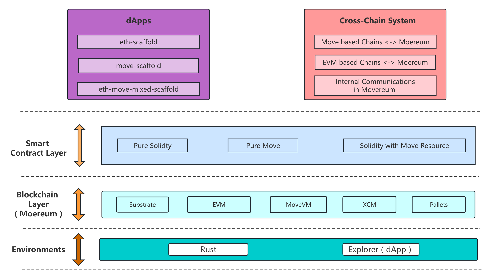

## Project

Project Name: Moereum

Start time: 2022.11

## Project Introduction

### Intro

	 Bridge EVM to MoveVM

Moereum Network provides the infrastructure for building dApps using EVM and MoveVM smart contracts, providing developers with true cross-consensus messaging (XCM) and cross-virtual machine (XVM) interoperability, and building a bridge between the EVM tether chain and the MoveVM chain. Moereum plans to become a parachain to serve developers on Polkadot.

### Background

Solidity's design has limitations and historical issues in many ways.
Therefore, just as Rust tries to fundamentally solve the limitations and historical legacy of C++, Move tries to break through the limitations of Solidity through the "new resource-oriented smart contract paradigm" and bring more blockchain and Web3 usage scenarios. Imagine more.
However, the development of the new paradigm requires a long process, and the new paradigm does not intend to replace the old paradigm. It is very likely that the two paradigms will coexist for a long time in the future. Therefore, the combination and communication between Solidity and Move contracts will be one of the important propositions in the future.
As a building block blockchain architecture design, both Substrate-based EVM and Substrate-based MoveVM designs have been developed to a certain extent. At the same time, we can also see some multi-virtual machine chain designs from previous cases, such as the design of EVM + WASM.

##### In this case, designing a Substrate parachain with EVM and MoveVM dual virtual machines -- Moereum is a reasonable and interesting exploration.

For Move-based Chains and EVM-Based Chains, with the help of Substrate's communication mechanism, Moereum can become a bridge between the two types of chains.
For dApps, the current Solidity contract can call the Move method, so as to attach the concept of resources to the Solidity contract, and explore more interesting ways to play smart contracts and dApps.

### Product

* Operating environment layer - Rust environment and browser environment, corresponding to the chain and dApp respectively.
* Blockchain layer - including the Substrate blockchain framework, EVM virtual machine, MoveVM virtual machine, XCM communication pallet and other pallet sets that need to be used.
* Smart contract layer - pure Solidity smart contract, pure Move smart contract, Solidity smart contract with Move Resource 
* Cross-chain system - Cross-chain from Move chain to Moereum, cross-chain from EVM chain to Moereum, cross-virtual machine communication inside Moereum.
* dApps —— Based on three dApp frameworks, eth-scaffold, move-scaffold and move-eth hybrid framework.

### Architecture

### Details

Details of our project are as below: 

* [Github Organization](https://github.com/NonceGeek)
* [Pitch deck](./docs/Moereum.pdf)
* [Video](./docs/demo.mp4)

## Plan to Develop

* 2022 Q4: Support evm and movevm and xcm
* 2023 Q1: Improve the chain tool collection and document ecology and conduct security audits
* 2023 Q2: Launch community testnet
* 2023 Q3: Final comprehensive security audit
* 2023 Q4: Ready to shoot Kusama Parachain

### Things to accomplish during the hackathon:

-   Moereum dual virtual machine chain implementation
-   Communication between Moereum EVM and Move virtual machine
-   Realization of Solidity with Move Resource smart contract and dApp Demo
    **Blockchain side**
-   `pallet-mvm`
    - [x] Move contract deployment (fn publishModule())
    - [x] Move contract method call (`fn execute()`)
    - [x] View Resource resource information (`fn view()`)
-   `pallet-evm`
    - [x] evm contract deployment
    - [x] evm contract method call
    - [x] eth api implementation
    - [ ] Precompiled method: call move contract method
      **Dapp side**
-   Realization of dapp demo

## Achievement in hackathon

Completed:
**Blockchain side**

- `pallet-mvm`
  - [x] Move contract deployment (fn publishModule())
  - [x] Move contract method call (`fn execute()`)
  - [x] View Resource resource information (`fn view()`)
- `pallet-evm`
  - [x] evm contract deployment
  - [x] evm contract method call
  - [x] eth api implementation

## Technology Team

Leeduckgo - NonceGeek Cofounder

Kei - NonceGeek Cofounder

kevin - substrate dev

Karl -  Frontend developer

Tomas - Substrate developer

- 4+ years’ experience in crypto.
- 4+years software coding experience in java/Go/Rust and Solidity DApps
- Polkadot senior ambassador, Substrate Evangelist, and early participants in the Polkadot ecosystem.

Dream4ever - Web developer

Fefe - product manager, web3 independent researcher,SEEDAO Contributor