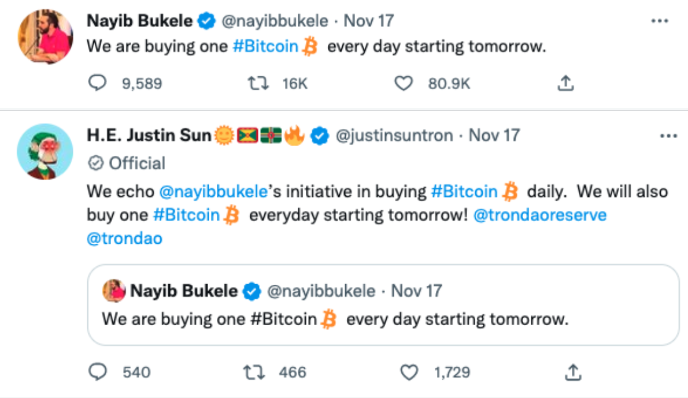
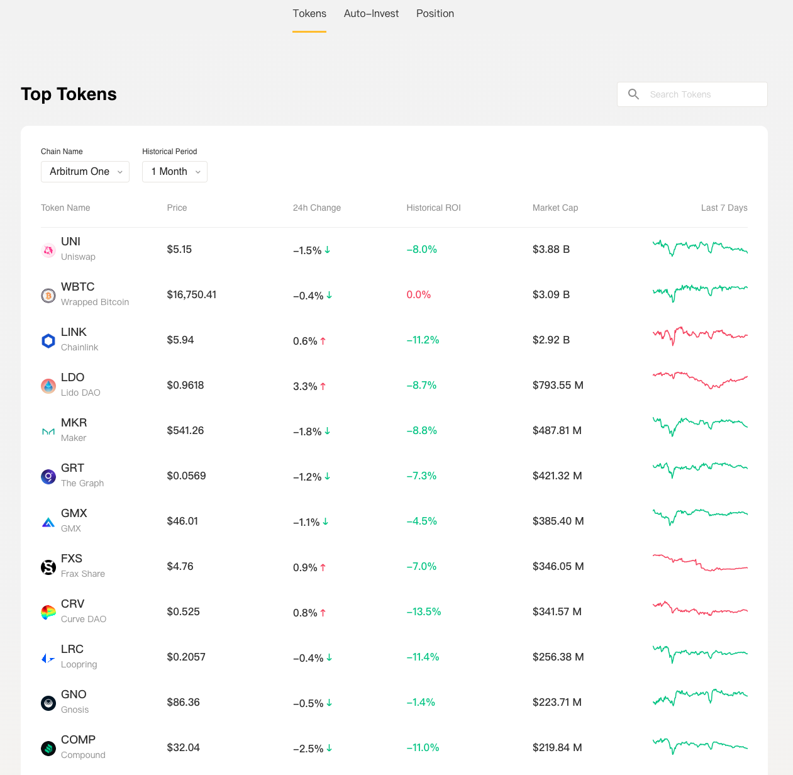
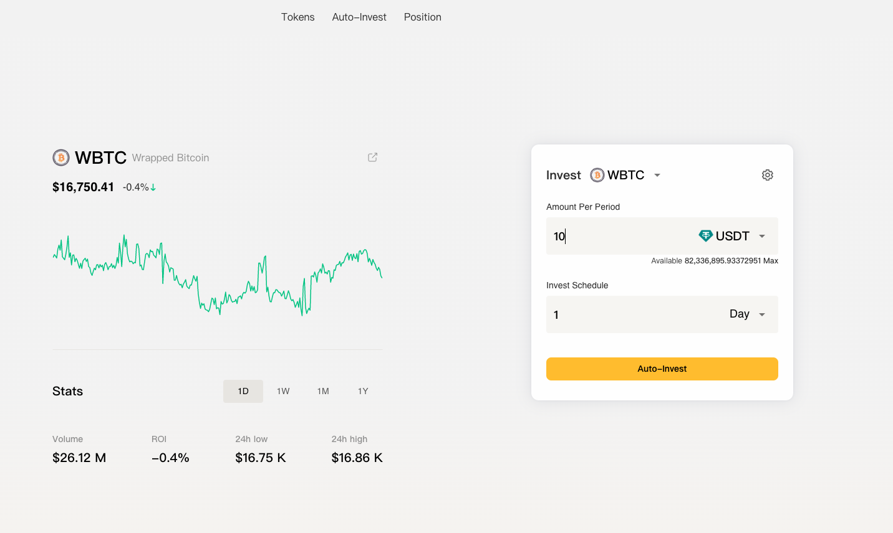
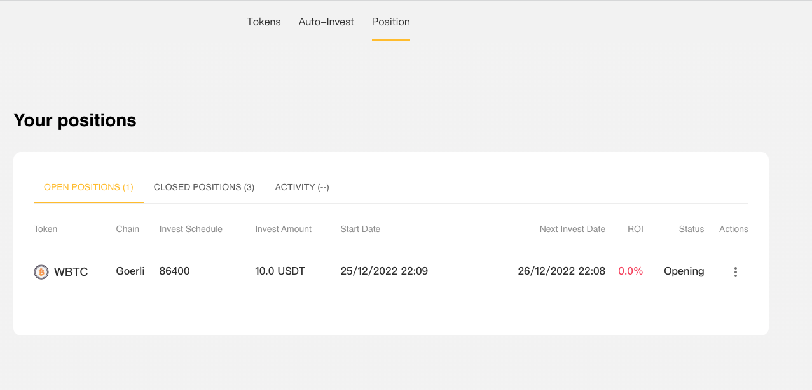
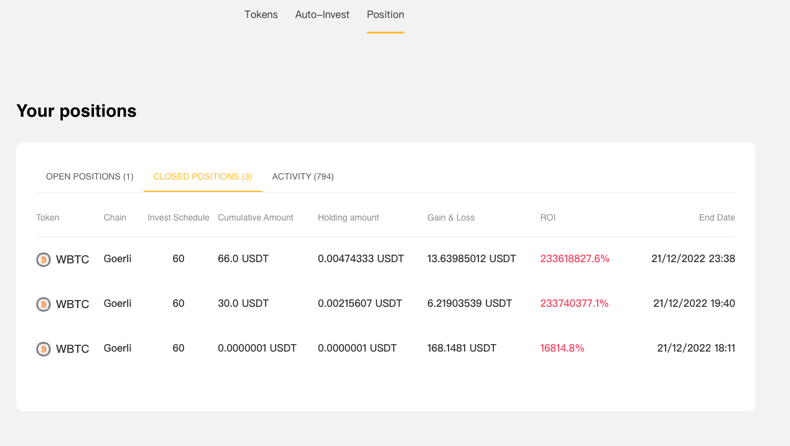
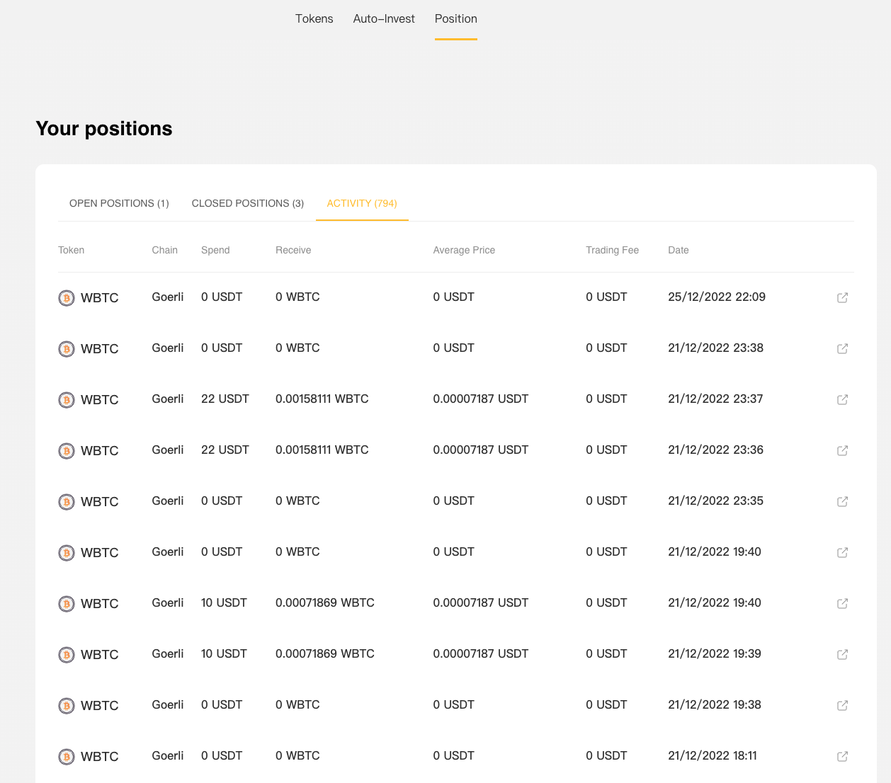
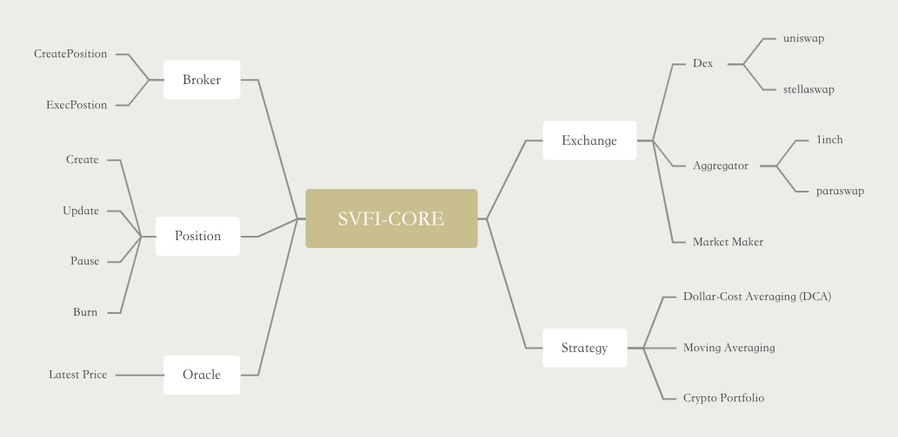

##### Translate to: [简体中文](README_zh.md)

## Project

Project Name：**Salvado Finance**

Project Approval Date：_2022.11_

## Introduction

### Background

The cryptocurrency market is melting down in 2022 and entering into the crypto winter. The collapse of FTX, the world's second largest DEX, has deepened investors' panic in the sector, and also exposed the current security problems of the crypto market where DEXes are popular in use. Therefore, the process of comprehensive decentralization is unstoppable.

It has been 14 years since Satoshi Nakamoto released the Bitcoin whitepaper on November 1, 2008, the ecosystem of blockchain industry has undergone huge changes. However, the high threshold, high risk, and lack of understanding of Web3 have limited many Web2 users into entering Web3 world.

Salvado Finance is designed to create a secure, non-custodial, and accessible decentralized investment platform, similar to a decentralized version of [Pionex](https://www.pionex.com/).

We are in the name of the country, Salvado, to pay tribute to the initiative in buying Bitcoin daily advocated on Twitter by cryptocurrency enthusiasts, represented by Nayib Bukele, the President of El Salvador.

Origin: https://twitter.com/nayibbukele/status/1593113857261965312

### Introduction

For individual investors, automatic investment in regular intervals is the best investment strategy to avoid risks for beginners and experienced investors.

Salvado Finance provides users with one-stop automatic investment services:

1. Historical ROI Analysis of Assets

   We have performed analysis on the historical ROI(return on investment) of core assets on multiple chains including Ethereum and Moonbeam. Users can clearly see the ROI and trend chart of different assets in a certain period of time, which helps users find out assets with a relatively high ROI and make the right investment decision.
2. Automatic investment strategies

   We have implemented four automatic investment strategies with smart contracts:
   - Dollar-cost averaging (DCA)
   - Mean automatic investment 
   - BL automatic investment 
   - Portfolio automatic investment

3. Group Auto-Investment

   Users can create a group auto-investment contract, and specify investment strategies, participation conditions, investment goals and withdrawal strategies in the contract. If other users are optimistic about the strategy, they can join the investment group and make investment together.
4. Auto-Invest as a Mining

   Investing on Salvado Finance is non-custodial, so the investment assets stay in their own wallet. Users can choose to custody their assets in the platform contract to help them stake, lend, add liquidity, and etc. to earn additional interests.
5. Investment Graph

   All investment behaviors on Salvado Finance will be recorded through SBT. The platform analyzes users’ investment behaviors and judge their investment experience, so as to make better investment decisions and let users learn through investment.
6. Auto-investing market maker

   In Salvado V1,  relayer helps users purchase target tokens from DEX or aggregators to make investment. In Salvado V2, auto-investing market makers will be added to help users invest with zero slippage in the form of orderbook, while market makers can also get incentives.

### Project Demo

Demo for experience(only supports beta network): http://salvado.finance/

### Architecture

The Salvado protocol mainly consists of the following five roles:
1. Broker (Controller)

   The Broker contract is the entry point for creating/executing the auto-investment strategy, responsible for verifying whether the auto-investment transaction is legal.
2. Strategy

   The Strategy contract provides users with different auto-investment strategies, such as DCA strategy. We have implemented the IStrategy.sol standard interface, so users can also deploy/share their customized strategies and use them on Salvado Finance. The composability of strategies is the key elements of the Salvado protocol.
3. Exchange

   The Exchange contract implements the logic of token exchanging. For example, to exchange ETH on Uniswap with USDT, users have multiple ways: Dex, Dex Aggregator, Market Maker, among which, via Market Maker it can achieve zero slippage exchange.
4. Oracle

   The Oracle contract provides the pricing function for the Salvado protocol, ensuring the security of assets and keeping the token price from the Exchange with little deviation from the actual price. At the same time, Oracle provides with more investment methods, such as: limited auto-investment, grid trading, etc.
5. Position

   The Position contract manages all auto-investment, so users can create, update, suspend, and terminate their investment at any time.
6. Relayer Service

   Relayer service can be performed by anyone to help users pay gas fees and complete investment transactions, while they can get a 0.2% gas fee reward.

## Project Logo

## Deliverables in Hackathon

**On-Chain: Contracts**

- `Broker`
  - [x] Create Auto-Invest Position (`fn createPosition()`)
  - [x] Execute Auto-Invest Position (`fn autoMatchPosition()`)
- `Strategy`
  - [x] DCA Strategy (`fn mintPositionNFT()`)
- `Exchange`
  - [x] Support dex Swap (eg.Uniswap) (`fn swapExactTokensForTokens()`)
- `Position`
  - [x] create Position (`fn createPosition()`)
  - [x] Pause/Unpause Position (`fn rotatePosition()`)
  - [x] Edit Position (`fn editPosition()`)
  - [x] stop Position (`fn rotatePosition()`)

**Off-Chain**
- [x] Multi-chain high-value token historical price synchronization, analysis of historical return on investment
- [x] Management of user position List
- [x] Relayer Service

**web frontend (react-native)**
- [x] Tokens List
- [x] Auto-investment creation process
- [x] Auto-investment management process
- [x] History of auto-investment

## Team

|Name|Function|GitHub|Twitter|
|---------|---------|---------|---------|
|Tyler|Tech|https://github.com/tyler2sv||
|Muniz|Tech|https://github.com/1160007652||
|Lester|Tech|https://github.com/HinadaC||
|Walter|Tech|https://github.com/walter1129||
|Jessica|UI/UX||@BFlAMbF1oUST0Bm|
|Wendy|Operations||@CryptoWendyz|
|Judis|Operations||@nft_sofa|
|Hannah|Operations||@morninghannah_|
