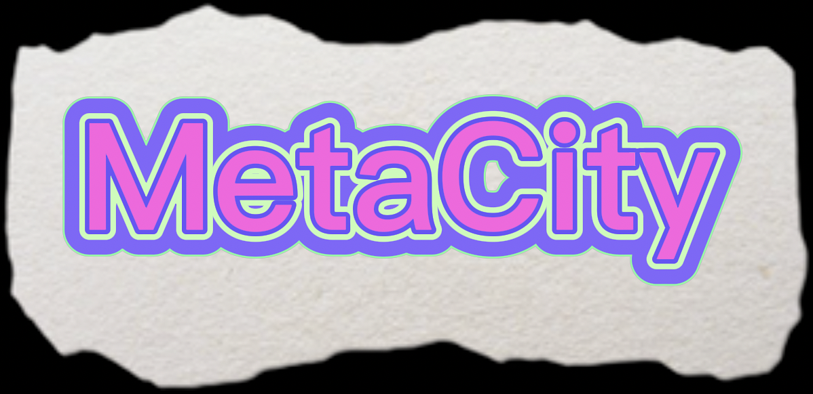

## Basic Information

Project Name: MetaCity

Project initiation date: 2022-10

## Project overall introduction

</img>

MetaCity is a graphic-text mmorpg onchain game. Players can play as different characters, have different skill points, and can interact with other players. The ultimate goal is to build a virtual city on the blockchain, so we call it MetaCity.

Some of the game inspiration is coming from a game called: [TornCity](https://www.torn.com/), one of the advantage for this type of game is that you only need a few minutes of an hour or a day to play, and get pretty much returns in the game. So it's a healthy game for people who want to save their time.

Another advantage for the game is that it doesn't need a quick feedback and doesn't need frequent operations, so it minimizes the disadvantage of blockchain's latency and gas fee. At the same time it shares the data transparency and security of blockchain. So I think it make best use of the advantages and bypass the disadvantages of blockchain, and it's maybe the most suitable type of onchain game.

## What was accomplished during the hackathon

During the hackathon, we just made a proof of concept demo of the game using ink! language, We plan to further build the game after ink! become more robust.

In this demo, users can choose different strategies to maximize their returns in the game. Generally speaking, we provided 3 different modes, if an user want to pay only a little time to play the game, She/He can choose the mode that provide loweset per unit time return but highest valid duration time, otherwise the opposite. That way, users can totally enjoy the game, without paying too much time on it.

## Player information

Name: peilin;  
Github: rusty-peilin;  
Wechat: peilin567;
