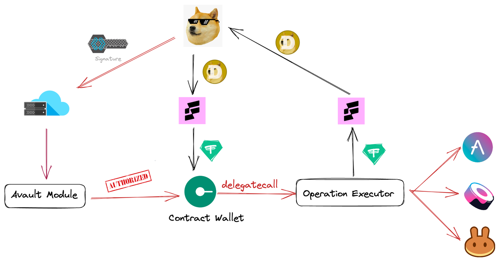

## About

Project Name：Avault

Started in：2022.2

## Project Details

### Overview
Avault is a one-stop omnichain yield platform that aims to lower the threshold for users to use Web 3 DeFi Dapps. Avault’s users can use any asset on any chain supported by Avault to interact with DeFi applications on other chains, truly realizing cross-chain compounding, staking, copy-trading, etc with one click.

### What problems does Avault try to solve? What is its value proposition?
We are now trying to break the current situation of this isolated island between chains. Although there is a lot of cross-chain projects, which help users complete asset bridging and swap, such as Multichain, Celer, XY Fianance, LI.FI, etc. But none of these actually break the isolated island formed between chains. Those protocols are only bridging the assets for users, but the users are still in place. If I want to use my money, I must go to the target chain to proceed to the next step. However, Avault is doing now is different.    
For the users, we help them achieve one-click bridge + swap + deposit + auto-compounding or even if other functions, which is equivalent to that user only need to stay on their own chain and use the assets they are most familiar with. Directly deposit money into applications on other chains to gain yield and operate. By using Avault, users can simplify the steps of gaining cross-chain yield from at least 6 steps to 3 steps. Users only need to think about their purpose when using the dApps. No longer need to think about how I should use this application, or how I could get to this chain, or what and how much gas fee I need to prepare.    
This can also better break the barriers between web2 and web3. Web2 users only need to enter the blockchain with their purpose and assets to enjoy the services and dApps of the blockchain, without having to learn the differences and knowledge between different chains first. Lower the threshold for them to use the blockchain.    
For project & ecosystem: We will be like the portal of project & ecosystem to connect other public chains. Other ecological assets can enter more conveniently through Avault and use easily. At the same time, it can also increase the stickiness of project & ecosystem users. In the previous cross-chain path, if users wanted to use the project or ecosystem on other chains, they needed to transfer assets from one chain to another, and because of the manual and complex cross-chain operations, it is easy to lose users or assets in the process. However, by using Avault, the assets and users will not be lost due to the use of applications on other chains. These users will still stay, and the final export of ecosystem users’ assets is still on the source ecosystem. Avault not only retains ecological users and assets for projects & ecosystems, has also achieved the role of introducing external ecological assets.    
This is the real way to lower the threshold and break the barriers between chains, let assets and users of different chains circulate. At that time, the rights of all chains and all assets were equal.     

### Architecture

### Roadmap
#### 2022 Q4
- One stop omnichain yield platform V1
- Realize omnichain compounding function
- Support gaining yield between ETH, BNB Chain, Arbitrum, Optimism
- Integrate with lending protocols
- Develop omnichain copy-trading (GMX)
- Integrate with AMM Dexes
- Integrate with LI.FI
#### 2023 Q1
- More different kinds of protocols
- More chains (Avalanche, Polygon, Cronos, Fantom, etc)
- Develop omnichain governance V1
- Realize omnichain staking
- Realize omnichain copy-trading (GMX)
#### 2023 Q2
- Support more chains, dapps, assets
- More chains (Aurora, Oasis, Injective, etc)
- Develop omnichain farm V1
#### 2023 Q3
- Support more chains, dapps, assets
- Realize omnichain copy-trading (dYdX)
- Launch omnichain farm
- Develop the integration between EVM & non-EVM

### logo

### Things planned to be done during the hackathon

**Blockchain**

  - [ ] Realize Omnichain compounding function between Arbitrum & Optimism
  - [ ] Support AAVE on Arbitrum & Optimism
  - [ ] Integrate with LI.FI to support omnichain swap

**Client**

  - [ ] Deposit page
  - [ ] Withdraw page
  - [ ] The pathway of asset

### Demo
 - demo video
 

### Members

Ericsson: Operation  
Sam: Smart contract/ Backend  
Alex: Product manager  
Hai: Front-end engineer  
Lee: UI/UX designer  