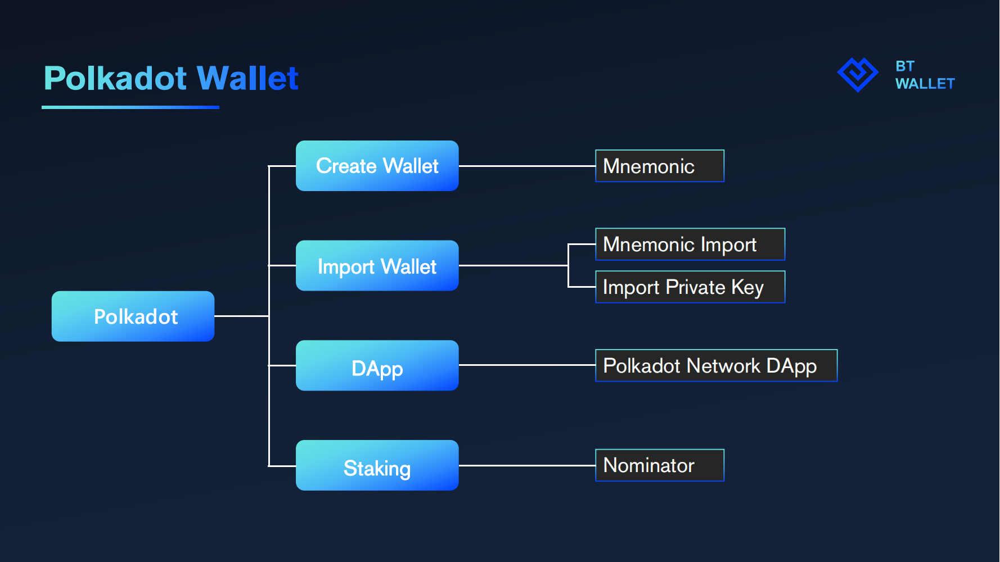
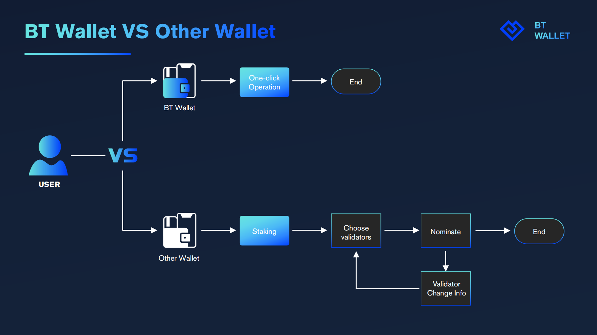
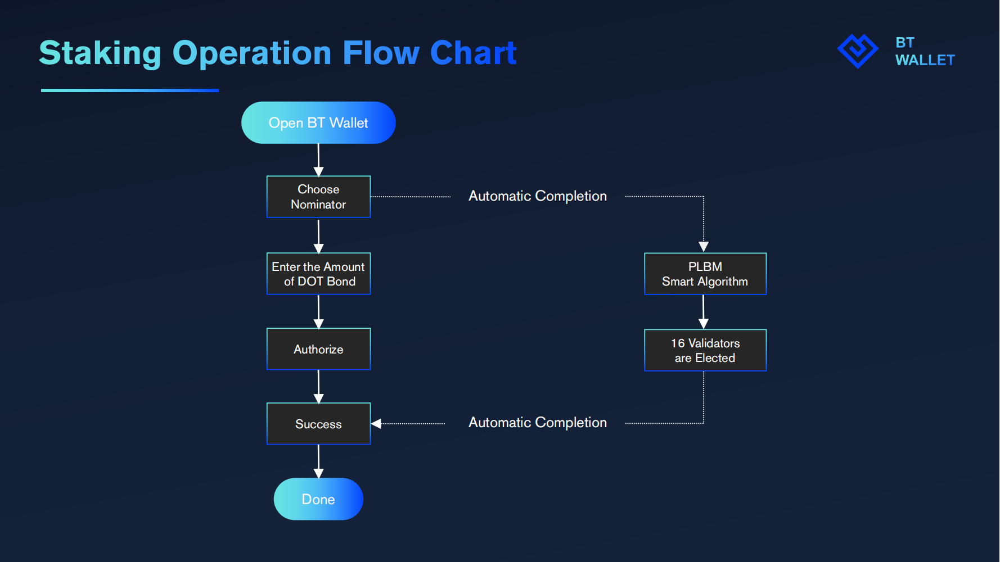
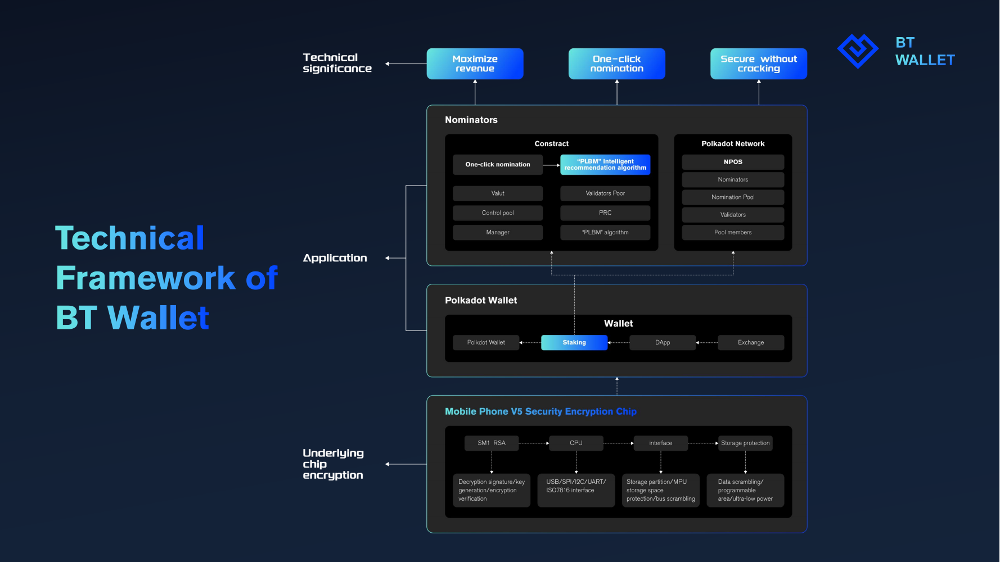
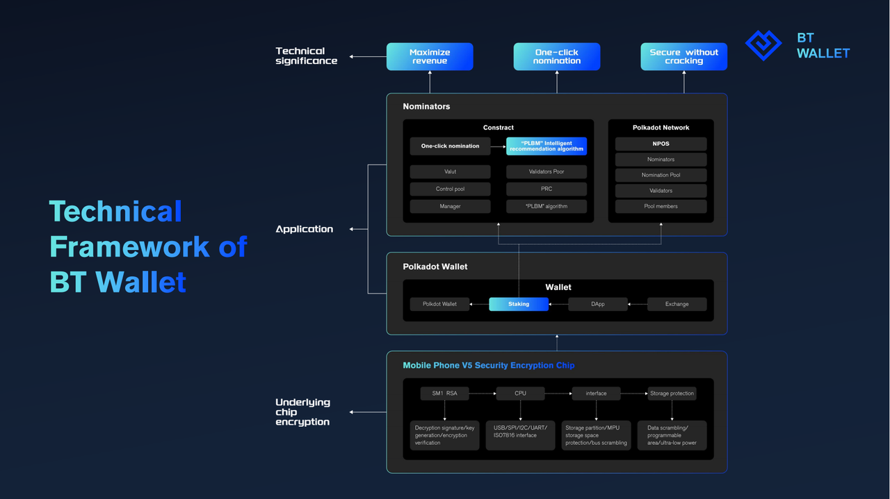

# English
## **1 Project**

Project Name：BT Wallet  
Project Approval Date：2022.11

## **2 Introduction**

### **2.1 Background**
Vitalik Buterin, the co-founder of Ethereum, recently shared his outlook on the encryption industry in 2023, proposing three "huge" opportunities that have not yet been realized in the cryptocurrency field, the first of which is the adoption of large-scale wallets. With the increasing development of the blockchain industry, the theft of digital assets emerges in an endless stream. Most of the reasons are due to the leakage of private keys or access to the Internet, which gives hackers an opportunity. V God once said at the Latin American Bitcoin Conference that wallet security is one of the biggest problems in the encryption field. At the same time, he also believes that more development can be done on the wallet infrastructure to make cryptocurrencies more accessible to everyday people, and may even attract billions of users. "If you can make a wallet that a billion people will use, that's a huge opportunity," Buterin said.  
Block Taker team, the main members of the team have more than 10 years of development experience, good at Golang, Java, Solidity, Kotlin, Substrate and other languages, have been deeply involved in traditional financial security and network security for many years, and have rich experience in security chip algorithms and blockchain development . The team positions the smartphone terminal as the next-generation web3 super entrance, and is committed to creating a wallet that can never be cracked, maximizes user benefits, and has the ultimate user experience with hardware facilities such as mobile terminals and encryption chips.  

### **2.2 Project Introduction**
The team positions the smartphone terminal as the next-generation web3 super entrance, and is committed to creating a wallet that can never be cracked, maximizes user benefits, and has the ultimate user experience with hardware facilities such as mobile terminals and encryption chips. BT Wallet is a lightweight, highly secure and multi-functional super wallet DApp application based on Polkadot ecology developed by the team in the first stage, integrating nominators, pledge mining, IPFS, etc. Security issues, and bring users a multi-functional one-click experience such as pledge, as the basic entrance of the web3 world, attracting more ordinary users and even professional users to embrace the Polkadot ecology.  
Ethereum founder V God once said at the Latin American Bitcoin Conference that wallet security is one of the biggest problems in the encryption field. In fact, wallets are still difficult to use, making them somewhat unsafe for non-technical users, which could spell trouble when cryptocurrencies are adopted on a mass scale, he argues. To this end, our team has brought an encrypted wallet mobile DApp based on financial-grade EAL6+ security chip technology and Polkadot ecology, BT Wallet, which provides a high-security solution for digital assets on the user chain and integrates multiple functions conveniently in the in the wallet. BT Wallet connects with the independent security chip on the specific mobile terminal, stores the private key separately and isolates it from the Internet, and provides users with the functions of creating, storing, using and restoring the private key of encrypted assets with high security, truly realizing " The hot and cold ends are separated, and the private key never touches the Internet."  
At the same time, through the original PLBM intelligent algorithm, it greatly reduces the complexity of ordinary users, provides one-click completion of the nominator function on the mobile terminal, and maximizes user benefits through intelligent recommendation algorithms. BT W
  
### **2.3 The Main Function**
#### **2.3.1 Encryption Chip**
Based on financial-grade EAL6+ security chip technology. The BT wallet stores the private key separately and isolates it from the Internet by connecting with the independent security chip on the specific mobile terminal, providing users with the creation, storage, use and recovery of the private key of encrypted assets with high security, and truly realizing the " The hot and cold ends are separated, and the private key never touches the Internet." 
 

#### **2.3.2 Polkadot Wallet**

#### **2.3.3 Nominator**
The nominator function of the BT wallet is to obtain the validator and nominator data through the API interface, and encapsulate the data through the original PLBM intelligent recommendation algorithm. Quantity, intelligently recommend 16 optimal verifiers and help users complete nominator operations. The intelligent recommendation system will recommend how much you invest to get rewards, and when the user is about to be out of the nominator candidate list (the first 256 nominators of a validator node have rewards), timely remind the user to replenish the amount to stabilize the ranking and other methods to achieve the least user investment. Earn the most.  
 

### **2.4 See More**

**Demo**   
https://www.pgyer.com/BT_stageEnv_v1

**Videos**

BT wallet  
https://youtu.be/qJgq0pak7ds

BT wallet demo  
https://youtu.be/dm98-R1B7m4

## **3 Achievement in hackathon**

**Blockchain**
- Nominator
  - Nominator SDK package
  - PLBM intelligent recommendation algorithm

**Client**
- Android App
  - Polkadot wallet creation process (creation + import)
  - Polkadot wallet transfer and collection process
  - One-click pledge and release of Polkadot nominees
  - Polkadot DApp access (relevant transactions available)

**Hardware**
- Smart Chip
  - V5 encryption chip

**Other**
- Technical white paper V1 version

## **4 RoadMap**

## **5 Technology Team**

**Samir（Captain，Technical Director）**
- Master's degree, computer science, University of Electronic Science and Technology of China
- Block chain, distributed storage expert
- 12 years of work experience, 8 years of blockchain project work experience
- Leading multiple distributed storage projects
- Worked in the top 10 blockchain companies
- E-mail: samirlol@qq.com

**Sivan（Core Developer）**
- computer science, Sichuan University
- WEB3 full stack development, Ethereum expert
- Blockchain contract development
- 10 years of work experience. Once worked for JD, Baidu, China Resources
- Proficient in Ethereum, Polkadot, BTC, Cosmos
- Email: kavenLee@protonmail.com

**Leedorn（Core Developer）**
- Master's degree, major in computer science, Zhejiang University
- Blockchain contract development, 7 years experience in blockchain project development
- Ethereum experts
- Worked in Chengdu Lianan
- Proficient in Polkadot, Solana, EOS
- Email: leedorn1833@outlook.com

**NoahZhao（Core Developer）**
- Computer Science
- Front-end development
- 5 years experience in blockchain development
- Proficient in Web3 project development
- Email: 578741931@qq.com

    
    
# 中文版本

## **1 项目**
项目名称：BT Wallet  
项目立项日期：  2022.11

## **2 项目简介**

### **2.1 项目背景**
以太坊联合创始人Vitalik Buterin近期分享了对2023年加密行业的展望，提出加密货币领域尚未实现的三个“巨大”机会，其中第一点就是大规模钱包的采用。随着区块链行业的日益发展，数字资产被盗的情况层出不穷，究其原因多是因为私钥泄露或者触网，给了黑客可乘之机。V神曾在拉丁美洲比特币会议上表示，钱包安全是加密领域最大的问题之一。同时他也认为可以在钱包基础设施上进行更多开发，使得加密货币更容易为日常人们使用，甚至有可能够吸引数十亿用户。Buterin说，“如果能制造出一个十亿人会使用的钱包，这是一个巨大的机会。” 
 
Block Taker团队，团队主要成员有10年以上开发经验，擅长Golang、Java、Solidity、Kotlin、Substrate等语言，在传统金融安全及网络安全领域深耕多年，拥有丰富的安全芯片算法及区块链开发经验。团队将智能手机终端定位为下一代web3超级入口，并致力于移动终端及加密芯片等硬件设施打造一款永不可破解、用户收益最大化、极致用户体验的钱包。
### **2.2 项目介绍**
团队将智能手机终端定位为下一代web3超级入口，并致力于移动终端及加密芯片等硬件设施打造一款永不可破解、用户收益最大化、极致用户体验的钱包。BT钱包是团队第一阶段开发的基于波卡生态的轻量化，高安全并集成提名人，质押挖矿，IPFS等多功能于一体的超级钱包DApp应用程序，目的是解决数字货币加密钱包领域的安全问题，并为使用者带来质押等多功能一键式体验，作为web3世界的基础入口，吸引更多普通用户乃至专业用户转向拥抱波卡生态。 
 
以太坊创始人V神曾在拉丁美洲比特币会议上表示，钱包安全是加密领域最大的问题之一。他认为，实际上钱包仍然很难使用，这使得它们对非技术用户有些不安全，当大规模采用加密货币时可能会带来麻烦。为此我们团队带来了一个基于金融级EAL6+安全芯片技术及波卡生态的加密钱包移动端DApp，BT钱包，为用户链上数字资产提供了高安全解决方案的同时将多功能便捷地集成在钱包之中。BT钱包通过与特定移动端搭载的独立安全芯片打通，将私钥单独储存，与互联网隔离，为用户提供了高安全性的加密资产私钥的创建、存储、使用和恢复功能，真正实现了"冷热端分离、私钥永不触网”。 
 
同时通过独创的PLBM智能算法，大大降低普通用户的使用复杂度，在手机移动端提供一键完成提名人功能，并通过智能推荐算法最大化增加使用者收益。BT钱包增强了波卡生态的易用性和安全性，降低了普通用户链接波卡生态的门槛，为波卡生态提供了一款高安全、低门槛、多功能移动端钱包DApp新选择。
### **2.3 主要功能**

#### **2.3.1 安全加密芯片**
基于金融级EAL6+安全芯片技术。BT钱包通过与特定移动端搭载的独立安全芯片打通，将私钥单独储存，与互联网隔离，为用户提供了高安全性的加密资产私钥的创建、存储、使用和恢复功能，真正实现了"冷热端分离、私钥永不触网”。 
 

#### **2.3.2 Polkadot Wallet**

#### **2.3.3 提名人**
BT钱包的提名人功能是通过API接口获取验证人和提名人数据，通过独创的PLBM智能推荐算法对数据进行封装处理，用户只需要在BT钱包上输入绑定数量，系统会根据用户绑定的数量，智能推荐16个最优的验证者并帮用户完成提名人操作。智能推荐系统会推荐投入多少就可获得奖励、在用户即将处于提名人候选名单外（一个验证者节点的前256个提名人有奖励 ）及时提醒用户补充金额稳住排名等方式实现用户投入最少，收益最大。
  

#### **2.3.4 更多**
**Demo**  
https://www.pgyer.com/BT_stageEnv_v1

**Videos**  

BT wallet  
https://youtu.be/qJgq0pak7ds

BT wallet demo  
https://youtu.be/dm98-R1B7m4

## **3 黑客松期间计划完成的事项**
**区块链端**
- 提名人
  -  提名人SDK封装
  - PLBM智能推荐算法

**客户端**
- 安卓App端
  -  波卡钱包创建流程（创建+导入）
  -  波卡钱包转账收款流程
  -  波卡提名人一键质押与解押
  - 波卡DApp接入（可进行相关交易）

**硬件端**
- 智能芯片
  - V5加密芯片

**其它**
- 技术白皮书V1版本
## **4 RoadMap**

## **5 团队成员**

**邵海（队长，技术负责人）**
- 硕士学位，电子科技大学计算机专业
- 区块链、分布式存储专家
- 12年工作经验，8年区块链项目工作经历
- 主导过多项分布式存储项目
- 曾就职于区块链前10强公司
- 邮箱：samirlol@qq.com

**马腾云（核心开发）**
- 四川大学计算机专业
- WEB3全栈开发，Ethereum专家
- 区块链合约开
- 10年工作经历，曾就职于京东、百度、华润
- 精通Ethereum、Polkadot、BTC、Cosmos
- 邮箱：kavenLee@protonmail.com

**李栋（核心开发）**
- 硕士学位，浙江大学计算机专业
- 区块链合约开发，7年区块链项目开发经验
- Ethereum专家
- 曾就职于成都链安
- 精通Polkadot、Solana、EOS
- 邮箱：leedorn1833@outlook.com

**赵黎明（核心开发）**
- 计算机专业
- 前端开发
- 5年区块链开发经验
- 精通WEB3项目开发
- 邮箱：578741931@qq.com  

