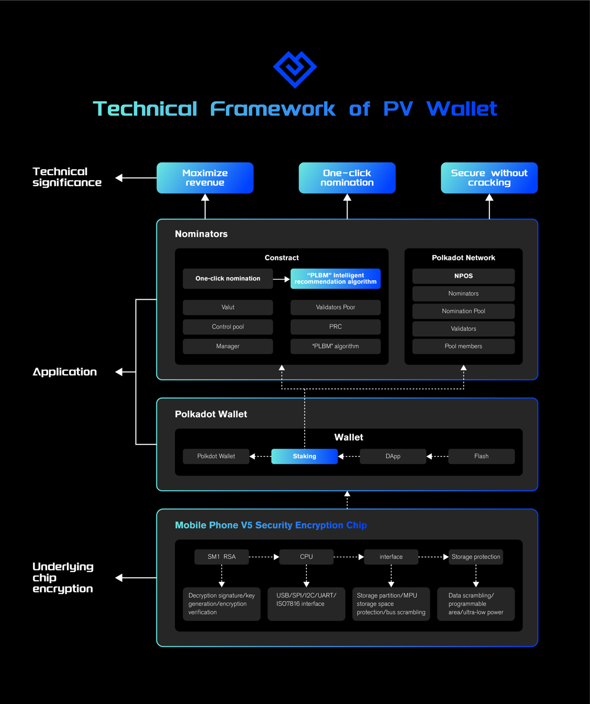

# Block Taker

### hello world

1.Project
Project Name：BT Wallet
Project Approval Date：2022.11
2.Introduction
[图片]
2.1 Background
Vitalik Buterin, the co-founder of Ethereum, recently shared his outlook on the encryption industry in 2023, proposing three "huge" opportunities that have not yet been realized in the cryptocurrency field, the first of which is the adoption of large-scale wallets. With the increasing development of the blockchain industry, the theft of digital assets emerges in an endless stream. Most of the reasons are due to the leakage of private keys or access to the Internet, which gives hackers an opportunity. V God once said at the Latin American Bitcoin Conference that wallet security is one of the biggest problems in the encryption field. At the same time, he also believes that more development can be done on the wallet infrastructure to make cryptocurrencies more accessible to everyday people, and may even attract billions of users. "If you can make a wallet that a billion people will use, that's a huge opportunity," Buterin said.
Block Taker team, the main members of the team have more than 10 years of development experience, good at Golang, Java, Solidity, Kotlin, Substrate and other languages, have been deeply involved in traditional financial security and network security for many years, and have rich experience in security chip algorithms and blockchain development . The team positions the smartphone terminal as the next-generation web3 super entrance, and is committed to creating a wallet that can never be cracked and maximizes user experience and revenue based on hardware facilities such as mobile terminals and encryption chips.
2.2 Project Introduction
The team positions the smartphone terminal as the next-generation web3 super entrance, and is committed to creating a wallet that can never be cracked and maximizes user experience and benefits based on hardware facilities such as mobile terminals and encryption chips. BT Wallet is a lightweight, highly secure and multi-functional super wallet DApp application based on Polkadot ecology developed by the team in the first stage, integrating nominators, pledge mining, IPFS, etc. Security issues, and bring users a multi-functional one-click experience such as pledge, maximize the user experience and actual benefits, as the basic entrance of the web3 world, attract more ordinary users and even professional users to embrace the Polkadot ecology.
Ethereum founder V God once said at the Latin American Bitcoin Conference that wallet security is one of the biggest problems in the encryption field. In fact, wallets are still difficult to use, making them somewhat unsafe for non-technical users, which could spell trouble when cryptocurrencies are adopted on a mass scale, he argues. To this end, our team has brought an encrypted wallet mobile DApp based on financial-grade EAL6+ security chip technology and Polkadot ecology, BT Wallet, which provides a high-security solution for digital assets on the user chain and integrates multiple functions conveniently in the in the wallet. BT Wallet connects with the independent security chip on the specific mobile terminal, stores the private key separately and isolates it from the Internet, and provides users with the functions of creating, storing, using and restoring the private key of encrypted assets with high security, truly realizing " The hot and cold ends are separated, and the private key never touches the Internet."
At the same time, through the original PLBM intelligent algorithm, it greatly reduces the complexity of ordinary users, provides one-click completion of the nominator function on the mobile terminal, and maximizes user benefits through intelligent recommendation algorithms. BT Wallet enhances the ease of use and security of the Polkadot ecosystem, lowers the threshold for ordinary users to link to the Polkadot ecosystem, and provides a new choice for the Polkadot ecosystem with a high-security, low-threshold, multi-functional mobile wallet DApp.
2.3 The Main Function
2.3.1Encryption Chip
Based on financial-grade EAL6+ security chip technology. The BT wallet stores the private key separately and isolates it from the Internet by connecting with the independent security chip on the specific mobile terminal, providing users with the creation, storage, use and recovery of the private key of encrypted assets with high security, and truly realizing the " The hot and cold ends are separated, and the private key never touches the Internet."
Security Chip Hardware Block Diagram
[图片]

Security Chip Main Functions
[图片]

2.3.2 Polkadot Wallet
[图片]

2.3.3 Nominator
The nominator function of the BT wallet is to obtain the validator and nominator data through the API interface, and encapsulate the data through the original PLBM intelligent recommendation algorithm. Quantity, intelligently recommend 16 optimal verifiers and help users complete nominator operations. The intelligent recommendation system will recommend how much you invest to get rewards, and when the user is about to be out of the nominator candidate list (the first 256 nominators of a validator node have rewards), timely remind the user to replenish the amount to stabilize the ranking and other methods to achieve the least user investment. Earn the most.

BT Wallet VS Other Wallet
[图片]
Nomination operation process

[图片]

BT wallet technical architecture diagram
[图片]

See more
Demo

Videos

3.Achievement in hackathon

Blockchain
- Nominator
  - Nominator SDK package
  - PLBM intelligent recommendation algorithm

Client
- App side
  - Polkadot wallet creation process (creation + import)
  - Polkadot wallet transfer and collection process
  - One-click pledge and release of Polkadot nominees
  - Polkadot DApp access (relevant transactions available)

Smart Chip
- hardware side
  - V5 encryption chip

Other
- Technical white paper V1 version

4.RoadMap

5.Technology Team
邵海-Samir（Captain，Technical Director）
- Master's degree, computer science, University of Electronic Science and Technology of China
- Block chain, distributed storage expert
- 12 years of work experience, 8 years of blockchain project work experience
- Leading multiple distributed storage projects
- Worked in the top 10 blockchain companies
- E-mail: samirlol@qq.com

马跃-Sivan（Core Developer）
- computer science, Sichuan University
- WEB3 full stack development, Ethereum expert
- Blockchain contract development
- 10 years of work experience. Once worked for JD, Baidu, China Resources
- Proficient in Ethereum, Polkadot, BTC, Cosmos
- Email: kavenLee@protonmail.com

李栋-Leedorn（Core Developer）
- Master's degree, major in computer science, Zhejiang University
- Blockchain contract development, 7 years experience in blockchain project development
- Ethereum experts
- Worked in Chengdu Lianan
- Proficient in Polkadot, Solana, EOS
- Email: leedorn1833@outlook.com

赵黎明-NoahZhao（Core Developer）
- Computer Science
- Front-end development
- 5 years experience in blockchain development
- Proficient in Web3 project development
- Email: 578741931@qq.com