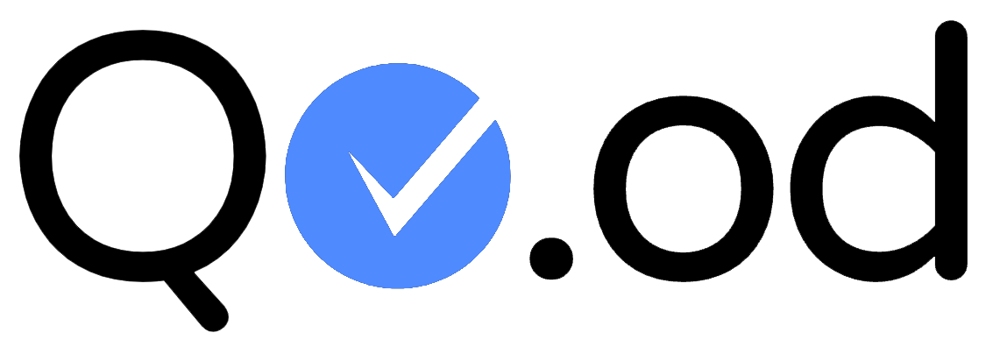
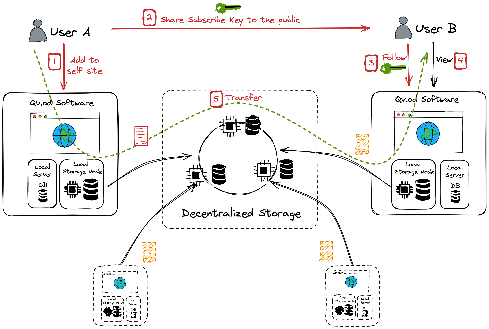

## Project Info

Project Name：Qv.od

Start date：2022 Dec

## Introduction

Qv.od is a Podcast platform/software based on decentralized storage. By using `Qv.od`, creative producers can focus on their creative works, rather than handle complex relationships with differnt platforms which determine the traffics to them, such as Apple Podcast, Google Podcast, and other similar multimedia platforms like TikTok, and so on.

On those centralized platforms, creative producers are facing problems of censorships, traffic manipulation, unreasonable advertise cost, super high split fees etc. 

We may say decentralized solution such `D.tube` can solve these problems in their way, but the fact is it's the perfect solution for the large numbers of creative producers.

Imaging, if you are a creative producer, what are the main issues you are facing when you are not the TOP ones in the world? Imaging if you are the fans of some creative producers, what is your biggest suffering when your favor channels are delete or closed?

No one can suffer the losing of your favor things, the same as your digital creatives.

Qv.od is designed to solve this issue with the original idea of `RSS`. We produce videos, Podcasts, Musics and other types of works to express our thoughts, we want keep our thoughts live as long as possible, and loved by some people we care. Qv.od provids the plaform/software to handle your own digital things you created or you loved(subscribed).

By using `Qv.od`, you just need import your videos, musics as `sites`, or follow the `sites` from best creative producers you like. Then `Qv.od` will handle the rest to keep syncing with each other. 

Creators can use `Qv.od` to distribute their works without any cost, thanks to web3 buidlers, and no one can break the connection between the creators and their fans. As the followers of some `channels`, `sites` can get notified when their subscribed `channels` or `sites` have updates, and the followers can PIN the contents locally without worry of lose them, which is the normal case on those centralized multimedia platforms. `Qv.od` brings new potential opportunities for the creator economics environment.

### Architecture

With decentralized storage technologies, `Qv.od` has the ability to sync through decentralized storage network, which is `CESS` in current stage.

`Qv.od` contains a local server which acts as an alternative to `CESS OSS`, the local server handles the connection to the decentralized network and serves the web application for `Qv.od`.

To creators, they just have two steps:
- Create Site/channel
- Share Site/channel Key

To followers, they just have one step:
- Import the site/channel they like

Currently, for MVP, `Qv.od` is a web application, later it will be implemented as a desktop/mobile application.

## Plan and complete status in hackathon

- `Qv.od Node`
  - [x] Integrate CESS
  - [x] Handle Connection to CESS
  - [x] Fix issue in CESS OSS
  - [x] Handle video convert
  - [x] Manage subscription
  - [x] Import/Export sites
  - [x] Handle following data
  - [x] Handle Media Sycning

- `Qv.od Web App`
  - [x] Mnemonic Management
  - [x] Create Sites/Channel
  - [x] Import Sites/Channel
  - [x] Export Sites/Channel
  - [x] Handle Import Media
  - [x] Handle Media Sycning
  - [x] Handle Share
  - [x] Handle Media Playing

## Team

Hzmangel  
Tech Lead / Backend Developer   
https://github.com/hzmangel  

Frozen  
Product / Tech Advisor   
https://github.com/xrdavies   

Noah  
Backend Developer / Tech support  
N/A  

晴空女王   
Front End Developer  
https://github.com/wendychaung  
