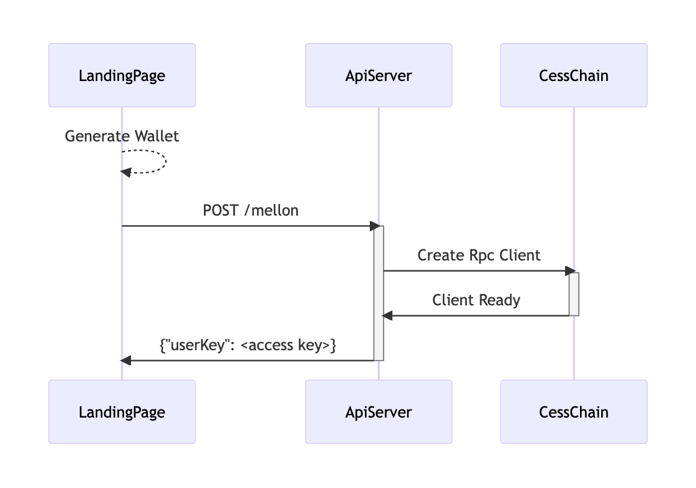
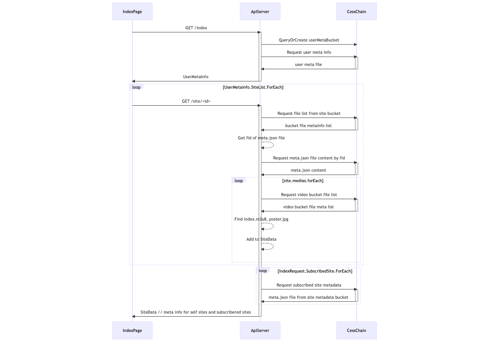
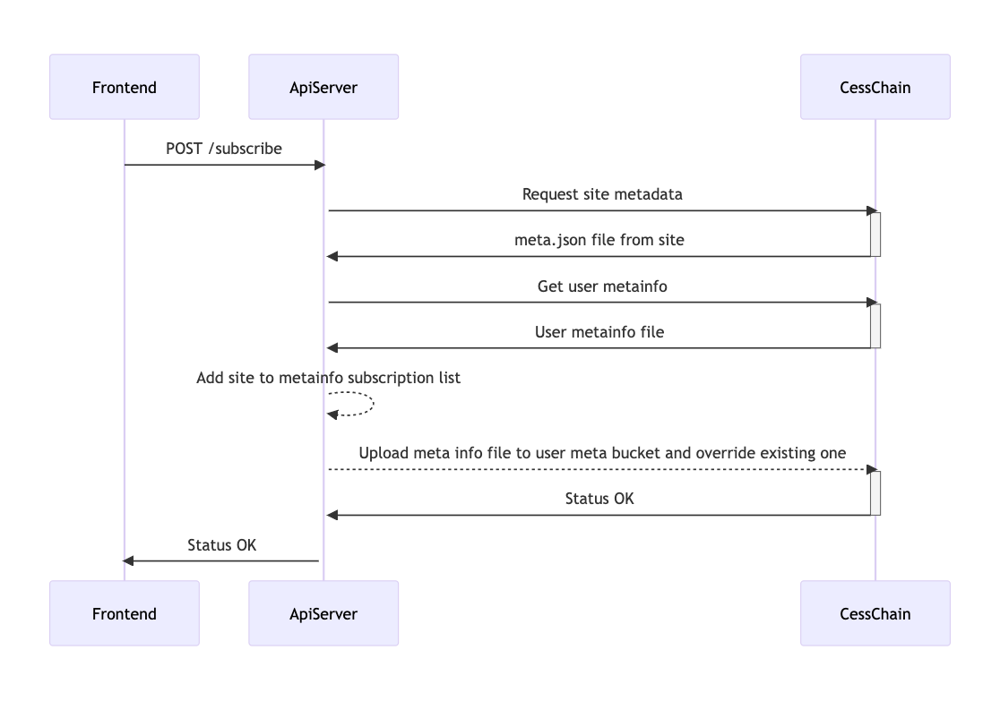
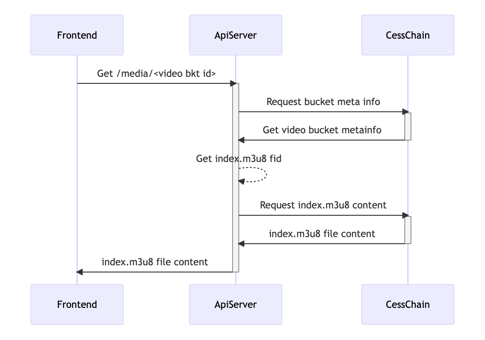
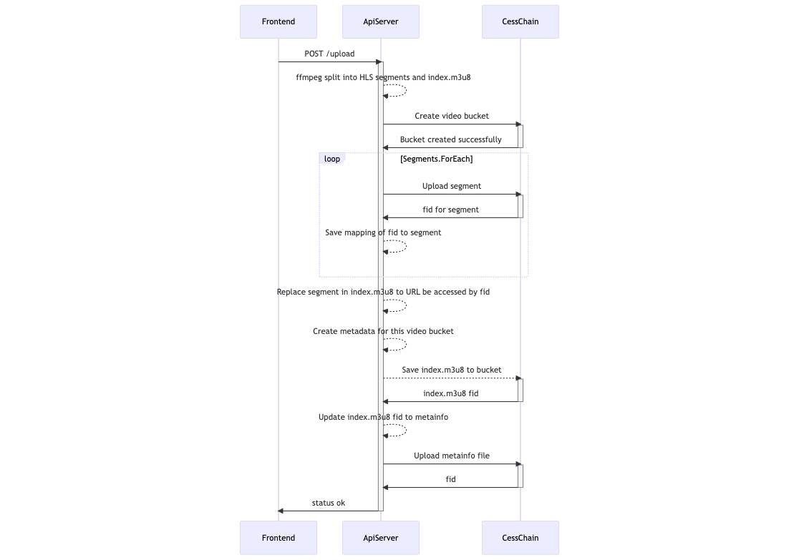

# Architecture

`Qv.od` contains a local server which acts as an alternative to `CESS OSS`, the local server handles the connection to the decentralized network and serves the web application for `Qv.od`.

As shown in above figure, these steps are:
- step 1 is to create own site/channel, and add media files to the site/channel.
- step 2 share the subsribe key to public, the public can get the subscribe key anywhere.
- step 3 the user import the subscribe key to Qv.od app, and he will start to follow the specific site/channel.
- step 4 the follower try to view the updates from the creator.
- step 5 the local `Qv.od` fetch the specific updates through the decentralized network.

## Seq figures

### List sites / Landing

### My Sites/Channel

### Create Sites/Channel

### Subscribe Sites/Channel

### View Media files

### Sync Media Files
