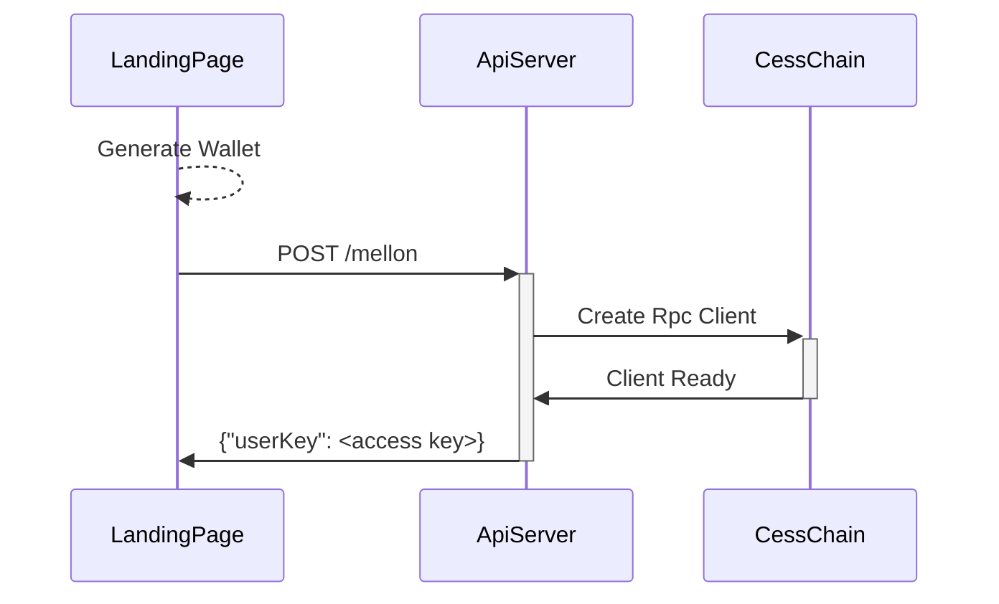
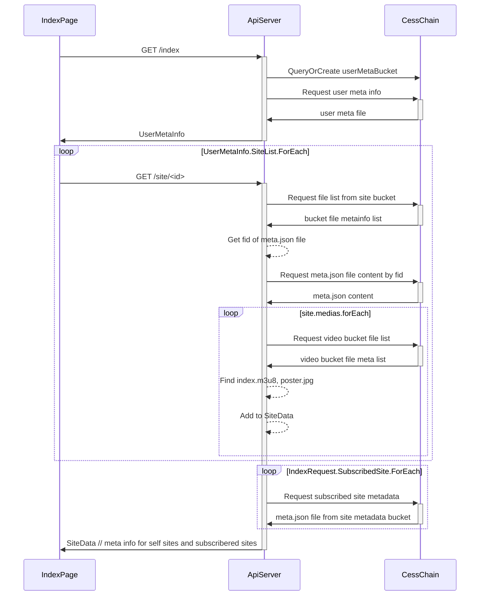
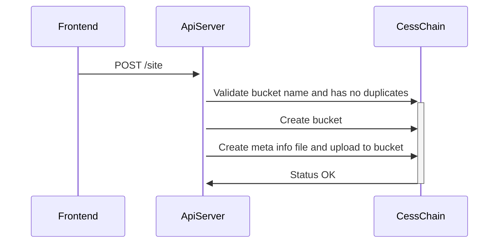
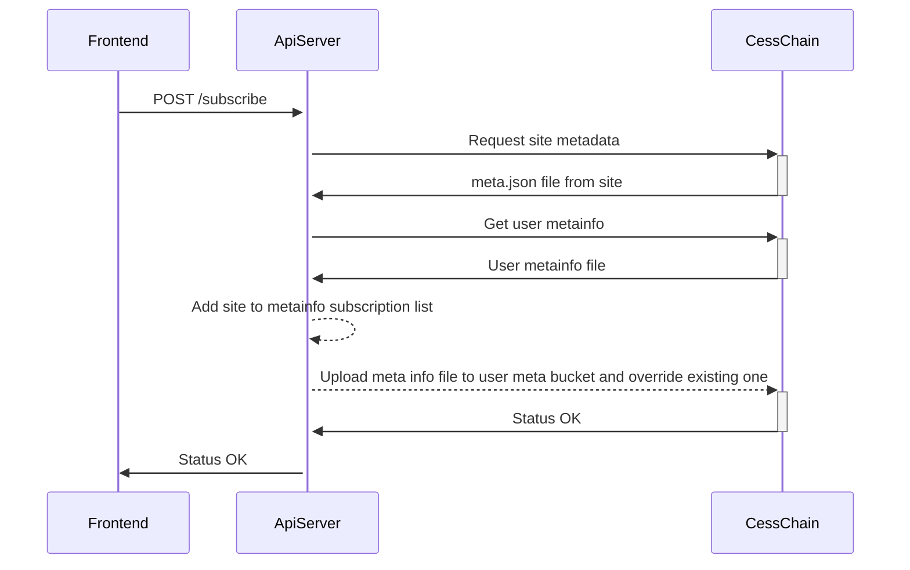
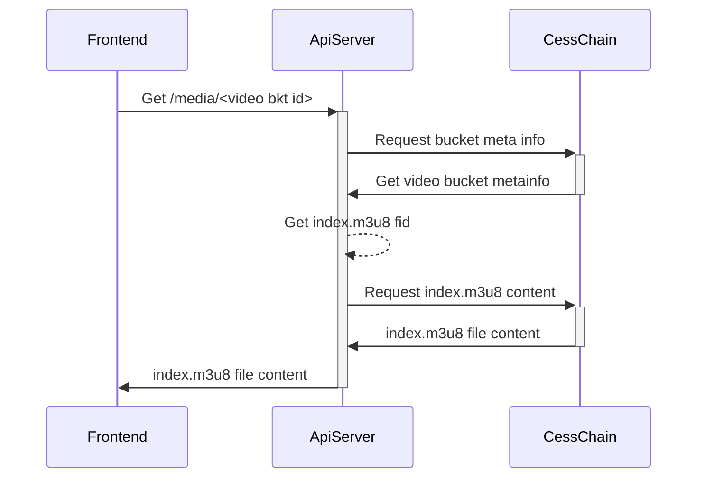
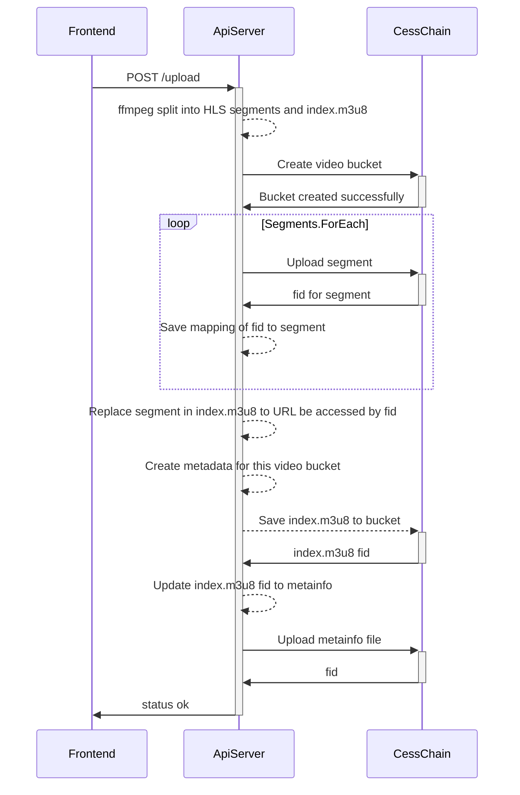

# API Server Function Flow and Models

## Functions

### Landing Page



After init API invoked successfully, jump to index page

### Index Page - Self Sites



### Create Site



### Subscribe to Site



### View media file



### Upload media file




<!-- ### Uploader

### Upload Video File

1. Split uploaded video file to HLS video segments with ffmpeg
    * In this step, several video segments and one m3u8 file will be generated.
      > Note: the segment path in m3u8 is relative path, which should be updated after saving to CESS
    * A thumbnail will also be generated in this step
2. Generate meta-info json file for this video, which contains (not stable)
    * title
    * description
    * upload timestamp 
    * storage-info (empty, will be filled in future)
3. Upload files to CESS
   1. Create bucket for new video
   2. Upload video segments and get related *fid*
   3. Replace video segment path in m3u8 file to *fid* with service access URL
   4. Upload updated m3u8 to bucket and get *fid*
   5. Update storage-info field in meta-info json, the format should be
      ```json
      {
        "bucket": <bucket name>,
        "files": {
          "index": <index.m3u8 fid>,
          "seg1": <seg1 fid>,
          ...
        }
      }
      ``` 
   6. Also update the upload ts of meta file
   7. Upload meta-info file to `user meta-info bucket`
   8. Create *user-id* file if not existing in `system meta-info bucket` 

### List My Uploads

1. List the files in `user meta bucket`
2. Get poster image and index.m3u8 to generate poster wall

## User Scenarios

### Watch Video

1. Access video URL: `GET /video/<user_id>/<bkt_id>`
   * The `bkt_id` is the bucket name of video
2. List `user meta bucket` with passed in `user_id` to get all videos bucket list for specified user
3. Match `bkt_id` in files downloaded from `user meta bucket` to get video detail
4. Download `index.m3u8` and return to player 
5. All the segments listed in the m3u8 file will be handled by api server

### Subscribe To User

> Note: subscription information is saved in local, the data will only be kept by user own
 
1. User click subscriber button, and the request is processed by frontend and saved locally

Local data may contains those items:

- User ID
- Last update timestamp for this user ID

### Get Updates

> When user click refresh button, or a repeat task

1. Get user ids from request
2. List all files from `user meta bucket`
3. Return new files newer than timestamp (or just return all data and make frontend to parse timestamp) -->
