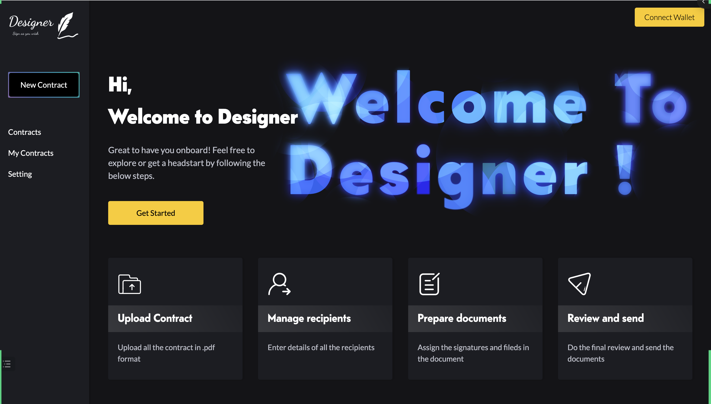
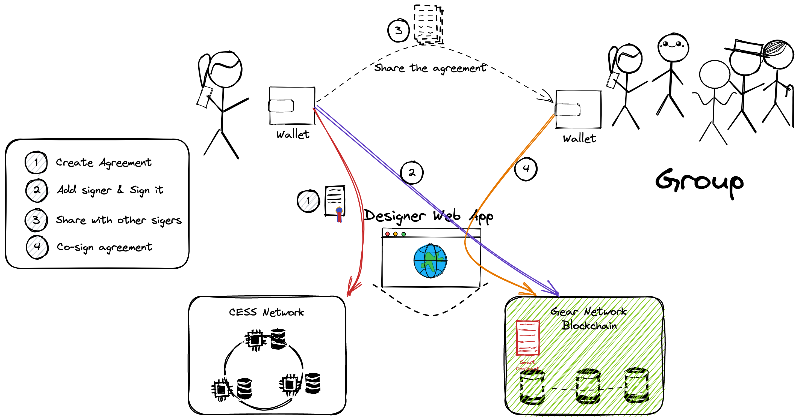

## Project Info

Name: Designer

Found Date: Dec 2022.

## Overview

`Designer` is a decentralized coordinate tool for DAO. With Designer, members in DAO can sign agreements with anyone not relying on any centralized services. The agreement content can be encrypted or public as needs. It's your freedom to sign any agreements as you wish in a pure web3 way.

Digital agreement is not a new thing. For a long time, digital agreements are supported by centralized services, like `hellosign`, `docusign`. By using those services, we are facing their censorship requirements, and we may lose our treasures if these services providers are broke.

Based on blockchain, smart contract and decentralized storage, we can build decentralized digital agreement platforms or tools. In the past years, there are several other tools saying they are based on decentralized technologies. Is it real? No, they are cheating. 

They are using decentralized technologies, but they don't let you know, there are also centralized SaaS/APIs used too. You will lose your treasures again, and you will facing censorship.

`Designer` is a pure decentralized digital agreement tool for DAO, because it's not rely on centralized technologies.

Designer uses Gear Smart Contracts which is a new way, and CESS as decentralized storage layer. The front end uses React + gear-js + polkadot-js/extention. 

### Tech

Designer is based on the decentralized storage project CESS and the WASM smart contract platform Gear.  

The Designer web app is being deployed on CESS, with the help of `OSS` component from CESS.

Anyone can access the web app and agreement files at anytime, without worry about losing them. The Gear Smart Contract provides the abilitiy to store and verify the co-sign information of the agreements, without any other SaaS dependencies, such as `thegraph` in Ethereum ecosystem, nor the `subquery` in Polkadot ecosystem.

The following graph shows the flow of how it works.

It's quite simple to use Designer. 

Firstly, just create agreement with the help of Designer Web App, currently only PDF file supported, later we will have more file formats. 

Secondly, add the co-signers' wallet addresses to the agreement, and submit the agreement to Designer smart contract which is depolyed on Gear Network, currently we use the `workshop nodes` provided by Gear Technologies. 

Thirdly, notify the co-signers through any communitcation tools as you wish. Or when they open the Designer Web App, they will see the agreements waiting for their signatures.

Fourthly, the co-signers sign the agreement using the Designer smart contract.

After all, the co-signers can view the agreements at anytime.

The details can be find [./docs/howto.md](./docs/howto.md).

The demo video can be find  [./docs/Designer-short%20clip.mp4](./docs/Designer-short%20clip.mp4) 

The instructions to build Designer can be find [./docs/build.md](./docs/build.md).

## Plan in Hackathon

**Blockchain**

- `gear contracts`
  - [ ] Add Gear Smart-Contract support
  - [ ] Verify signatures in smart contract
  - [ ] Store agreements in smart contract
  - [ ] Access control in smart contract

- `CESS`
  - [ ] Add CESS support
  - [ ] Customize the CESS SDK
  - [ ] Customize CESS gateway
  - [ ] Access control

**Client**

- Web App
  - [ ] User Auth
  - [ ] Create Agreements
  - [ ] Sign Agreements
  - [ ] Share Agreements
  - [ ] Verify Agreement signature

## Things done in Hackathon

The project is build from scratch in this Hackathon.

**Blocchain**
- `gear contracts`
  - [x] Add Gear Smart-Contract support
  - [x] Verify signatures in smart contract
  - [x] Store agreements in smart contract
  - [x] Access control in smart contract

- `CESS`
  - [x] Add CESS support
  - [x] Customize the CESS SDK
  - [x] Customize CESS gateway
  - [x] Access control
  - [x] Customize the CESS OSS
  - [x] Fix issues in CESS code

**Client**

- Web App
  - [x] Integrate Gear Smart-Contract
  - [x] Integrate CESS Storage
  - [x] User Auth
  - [x] Create Agreements
  - [x] Sign Agreements
  - [x] Share Agreements
  - [x] Verify Agreement signature

## Team

Hack  
Smart Contract Engineer  
github id: 0xack4  

Olg  
Product Manager  
github id: olgwander  

Wendy  
Web Engineer  
github id: wendychaung  

大胡子天使  
Tech advisor   
github id: N/A  

