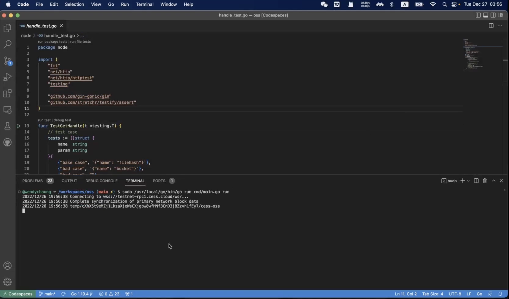
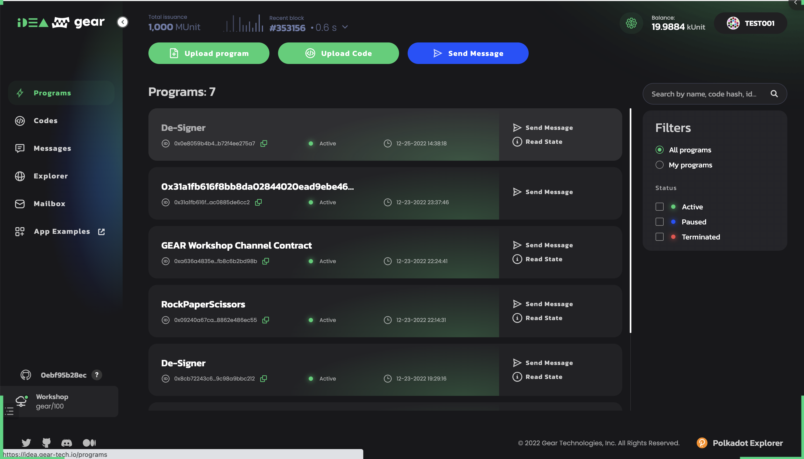
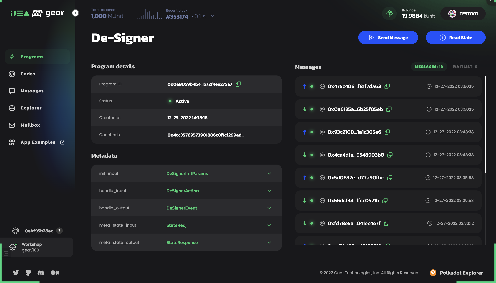
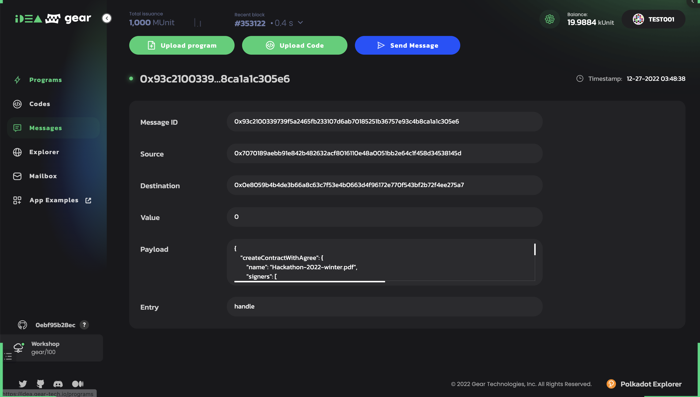
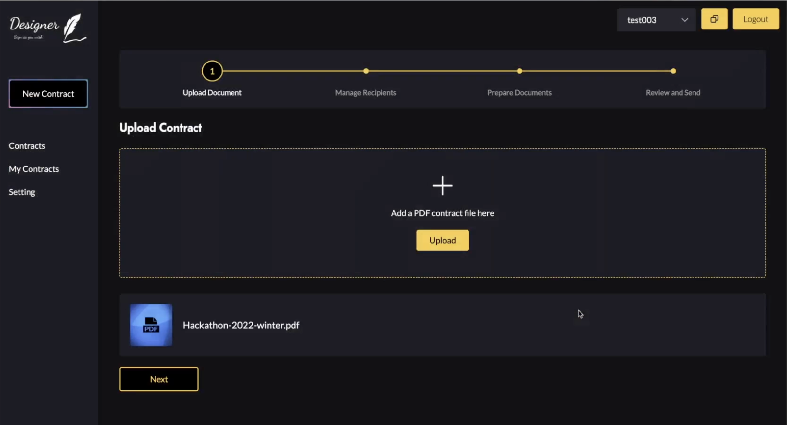
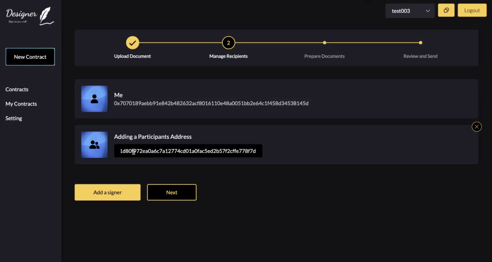
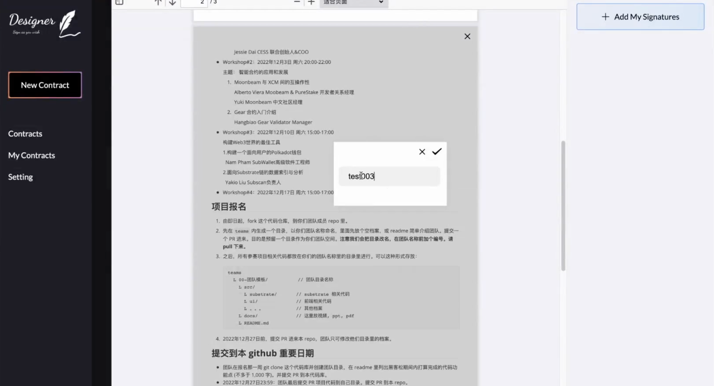
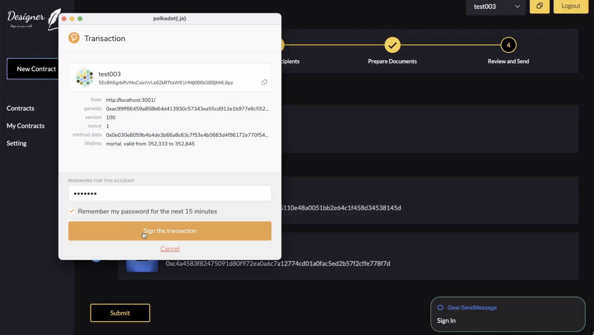
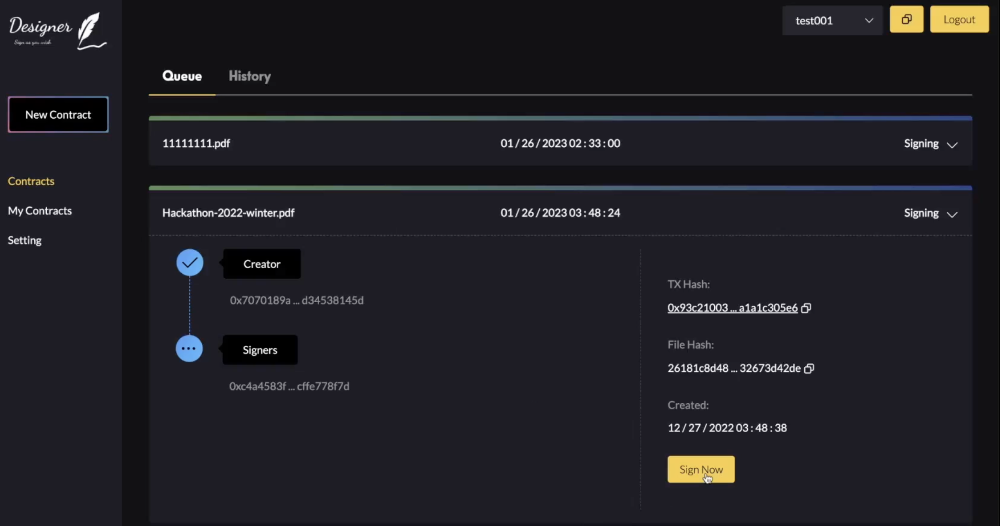
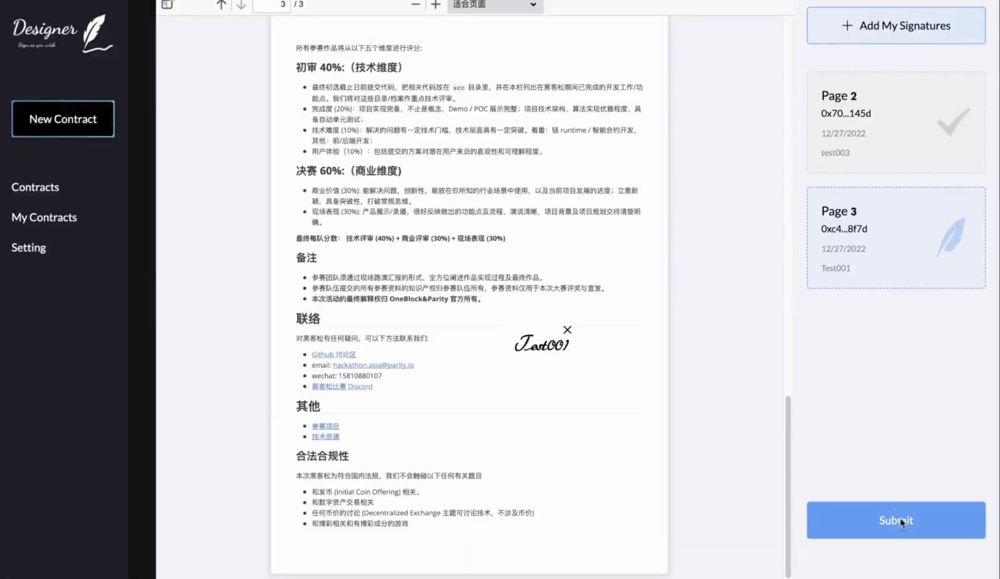

# How to use Designer

## The work flow

It's quite simple to use Designer. 

Firstly, just create agreement with the help of Designer Web App, currently only PDF file supported, later we will have more file formats. 

Secondly, add the co-signers' wallet addresses to the agreement, and submit the agreement to Designer smart contract which is depolyed on Gear Network, currently we use the `workshop nodes` provided by Gear Technologies. 

Thirdly, notify the co-signers through any communitcation tools as you wish. Or when they open the Designer Web App, they will see the agreements waiting for their signatures.

Fourthly, the co-signers sign the agreement using the Designer smart contract.

After all, the co-signers can view the agreements at anytime.

## Steps
### Prepare
Follow the steps to build customized OSS before start OSS, the steps can be find in [./build.md](./build.md).

Start the customized CESS OSS, this version is customized for Designer and it will be replaced when CESS project launchs their mainnet.

Check the smart contract on Gear Network, [https://idea.gear-tech.io/programs?node=wss%3A%2F%2Fnode-workshop.gear.rs](https://idea.gear-tech.io/programs?node=wss%3A%2F%2Fnode-workshop.gear.rs)

Start Front End, the steps can be find in [./build.md](./build.md). When front end is started, you will see the screen as below.

**Please make sure the program id in .env is the same as the program id in Gear's idea**

### Create Agreement

Connect your wallet, and click `New Contract` in the left nav, and drop-in your agreement file.

### Add co-signer

Click `Next`, and add co-signer. **Please be careful, the co-signer wallet address should be Gear's format**

### Add own signature

Click `Next`, then click `Add My Signatures` in the right panel.

### Submit to smart contract

Click `Submit` and input your password in `Polkadot Js Extension`.

### Share the agreement with the co-signers and let co-signers sign it

Connect to co-signer's wallet, and the agreement which is waiting for sign will be shown in the `Queue`.

Click `Sign Now` to sign the agreement.

