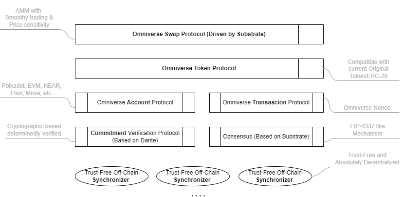

## Basic

Name: O20k (Omniverse Protocol Stack)

Start Time: 2022.12

## Introduction

### Background
As we all know, Token is a great invention that goes along with blockchain, and it’s the impetus of Web3.

It has many extrinsic properties, like act as an asset, currency, vote, DID or PFP and so on. These functions vary with different projects.

Besides, it also has some intrinsic properties, which is invariable, no matter what extrinsic properities it has. These intrinsic properities including `transfer`, `receive`, `exchange` and so on.

Nowerdays, There are some problems with it’s intrinsic properities, and maybe affect the expression of it’s extrinsic properties.

It’s not a big problem when we concentrate on single chain, but it’s serious when we enter into the multichain stage.

That is, we can hardly processing Token in the multi-chain environment.

Take `exchange` for example.

When we need to exchange tokens from different chains, most of the time ,we need to ues CEX.

CEX is very convenient and efficient, but as we all know, it's and very easy to manipulate under the table. As a user of CEX, you don't really control your own assets, FTX is the best case recently.

DEX is decentralized，and the assets is on your own hand, we always say that code is law, it means you can handle your assets under the established and transparent rules, no one can manipulate your assets outside of these rules. But the fagmentation is a problem that has plagued DEX for a long time, that is, we cannot swap tokens of different chains easily.

That's why some token bridges emerge. With bridges, the assets should be locked on one chain and minted on another chain so that your assets are cut into different parts on different chains and one part can be only used on one chain at a time. Moreover, many [secure events](https://github.com/xiyu1984/Blog/blob/main/docs/Multi-Chain%20Events.md) happened on current bridges.The bridge is just like a bank, issue wrapped tokens, anyway, when you ues the bridge, you just deal the wrapped token, not the really token of your own.

There are similiar problems with `transfer` and `receive`.

To solve these problems, we will provide a base protocol stack for decentralized token processing, which is named as `Omniverse Protocol Stack` (`O20k` for short).
The core meaning of `Omniverse` is that ***The legitimacy of all on-chain states and operations can be equivalently verified and recorded simultaneously over different consensus spaces, regardless of where they were initiated.***

 <!-- a brand new Token Protocol compatible with current token standards along with an advanced swap platform, which is absolutely decentralized and cryptographic-based solution, through which the exchange between tokens deployed on different chains can be processed with determining security. Besides, there's no need to divide your assets into different isolated parts, on the contrary, your assets can be accessed from any chain and be treated as a whole. -->

### Introduction
Based on the philosophy of `Omniverse`, we build `O20k` as a DLT protocol stack built on multiple existing L1 public chains, enabling asset-related operations such as transfers, receptions, and transactions running over different consensus spaces synchronously and equivalently.  
The main advantages of "O20k" are as follows:  
* **Efficient Legitimacy Synchronization**. The validation of the equivalent legitimacy over different consensus spaces can complete within one step.  
* **Free Swapping without Boundaries**: The token exchanges over different blockchains are open and decentralized and related assets are not segmented into different blockchains but as a whole.  
* **Deterministic**. Security is guaranteed deterministically in a decentralized and trustless environment.  
* **More Efficient AMM**. Provides an improved mathematic model supporting both smooth trading and price sensibility, and specific verifiable computation is brought in to improve efficiency.
<!-- We are b named it `Omniverse Protocol Stack` (`O20k` for short) , which can do exchanges for different kinds of tokens distributed in diverse chains.   -->
The innovation points of `O20k` are shown as below:  
* First, we provide a brand new standard called `Omniverse Token Protocol`(`OTP` for short), whose legitimacy can be validated equivalently and be synchronized to any chain where `OTP` is deployed so that it to be accessed and operated anywhere at the same time as a whole, which is unlike being divided into isolated parts by token bridges. Besides, `OTP` is able to be compatible with current single-chain token protocols.  
* Second, an `Omniverse Swap Protocol` (`OSP` for short) is provided to make exchanges for different kinds of `OTP` tokens just like a CEX did but in a decentralized way. One `OTP` token can directly exchange with another `OTP` token on Polkadot, and the related states could be verifiable on other `O20k` deployed chains such as Ethereum, NEAR, Flow, Move chains, etc.  
* Moreover, AMM is used to make calculations for exchanges and we innovatively worked out a new mathematical model called `O-AMM` to implement it, which can provide a wider "smooth trading range" than state of art and still keep the price sensitivity. 

For implementation, we will build a Substrate Parachain to make out `O20k`, which can connect the other Parachains by `XCM` so that `O20k` could provide services for the whole ecosystem of Polkadot.  

* The `OTP` has the following features:  
  * The token based on `OTP` deployed on different chains is not separated but as a whole. If someone has one `OTP`-based token $X$ on Polkadot, he will have an **equivalent** one on Ethereum and other chains at the same time.   
  * The state of the tokens based on `OTP` is synchronous on different chains. If someone sends/receives one token $X$ on Polkadot, he will send/receive one token $X$ on Ethereum and other chains at the same time.  
  * The `OTP` works as below. ***Note that in an Omniverse token transaction the user only needs to initiate a sending transaction on whatever blockchain he prefers, and the rest things are all processed by the underlying protocols***.  

Figure.1 Workflow of OTP

* The `OSP` has the following features:  
  * `OSP` is a decentralized DEX platform for Omniverse Tokens. Omniverse token $X$ can be exchanged with Omniverse token $Y$ through `OSP`. Similiar to `OTP`, the swap happens as a whole on Polkadot and other blockchains. If someone initiate a swap of $X$ with $Y$, he will give out some amount of $X$ and get corresponding amount of $Y$ on Polkadot and all blockchains where `O20k` deployed.  
  * The Omniverse account of `OSP` is managed by the consensus of the `O20k` Parachain.
  * The `OSP` works as below. ***Note that in an Omniverse swap operation the user only needs to initiate an exchange transaction of token $X$ to token $Y$ on whatever blockchain he prefers, and the rest things are all processed by the underlying protocols.***  

Figure.2 Workflow of OSP

* The `O-AMM` is the core mechanism supporting the underlying exchanges of the `OSP`, which has the following features:  
  * Ability to balance smoothness and price sensitivity at the same time.
  * The mathematic curve is as below, and we have provided the [Principle of Omniverse AMM](./docs/Principle%20of%20Omniverse%20AMM.md) for detailed explanation.  
  

Figure.3 Mathematic Model of `O-AMM`
  

### Demo
* You can taste everything mannually
  * Omniverse Swap and Token operations can be tried through this [detailed tutorial](./docs/README.md).
  * The prototype of `O-AMM` can be tried through this [guide](./src/O-AMM/README.md).  
* The whole workflow also can be found through this [Demo Video](https://omniverse.oss-cn-hangzhou.aliyuncs.com/omniverse-swap.mp4).  

### Architecture
  

Figure.4 Architecture of Omniverse Protocol Stack
  

The full protocol stack of `O20k` includes several layers. From the top to the bottom, they are `OSP`(Omniverse Swap Protocol), `OTP`(Omniverse Token Protocol), Omniverse Account and Transaction Protocol, verification and consensus layer, and Trust-Free Off-Chain Synchronizers.  

The `OSP`(Omniverse Swap Protocol) is a direct swap platform for exchanges of Omniverse tokens. The calculation of the transaction amount is done by an `O-AMM` model we create. The details of the underlying mechanisms can be found in the [Principle of Omniverse-AMMM](./docs/Principle%20of%20Omniverse%20AMM.md). An omniverse swap operation can be initiated based on the `OTP`(Omniverse Token Protocol). `OSP` is implemented as a `substrate pallet`, and a mechanism similar to [EIP-4337](https://eips.ethereum.org/EIPS/eip-4337) is made out to operate an abstract account for the omniverse swap along with the substrate consensus.     

The `OTP`(Omniverse Token Protocol) is implemented as a `substrate pallet` on Polkadot, and as a smart contract on other chains(EVM chains for instance). A special cryptographic commitment is used to make a verification when a change in ownership of the token occurs, which can be verified in an equivalent approach on different tech stacks of different blockchains. The special commitment is unfakeable and non-deniable. Moreover, the transfer of Omniverse tokens happened on an Omniverse Account Protocol, and be guaranteed by an Omniverse Transaction Protocol.  
The implementation of the `Omniverse Account Protocol` is not very hard, and we temporarily choose a common elliptic curve `secp256k1` to make it out, which has been already supported by many blockchains. The `Omniverse Transaction Protocol` guarantees the ultimate consistency of transactions across all chains. These two protocols are working together to ensure the effectiveness of the `OTP`.  

The commitment verification protocol and consensus are underly mechanisms. The former provides an absolute cryptographic way to make verifications for special designed operations of `OTP`, in which malicious things could be found out determinedly. The latter is provided by the framework of `Substrate`, and an EIP-4337 like abstract account and a [verifiable computation for `O-AMM` calculation](./docs/Principle%20of%20Omniverse%20AMM.md#gas-mechanism) is made out along with the consensus mechanism.

The bottom is the off-chain synchronizer layer. The synchronizer is a very light off-chain procedure, and it just listens to the Omniverse events happening on-chain and makes the information synchronization. As everything in Omniverse paradigm is along with a commitment and is verified by cryptographic algorithms, there's no need to worry about synchronizers doing malicious things. So the off-chain part of `O20k` is indeed trust-free. Everyone can launch a synchronizer to get rewards by helping synchronize information.  

In addition, we provide a [proof for the ultimate consistency](https://github.com/xiyu1984/o-amm/blob/main/docs/Proof-of-ultimate-consistency.md) for better understanding of the Omniverse Protocol.  

### logo
  

## Plan

**On-Chain**

- `pallet-OmniverseProtocol`
  - [x] Omniverse Account Management
  - [x] Omniverse Nonce Synchronization
  - [x] Omniverse Commitment Verification

- `pallet-OmniverseToken`
  - [x] Omniverse Token Factory
  - [x] Omniverse Token Processor

- `pallet-OmniverseSwap`
  - [x] Omniverse Swap Platform

**Algorithm**
- `O-AMM`
  - [x] The ptototype of O-AMM (Omniverse AMM) algorithm.

**Client**
- Command-Line Interface
  - [x] Omniverse Transaction Tools
  - [x] Omniverse Swap Tools
  - [x] Omniverse Account Tools  

## Completed

Everything in the [plan](#plan) has beed finished.
- **On-Chain**, Full Source code of the Substrate node can be found [here](https://github.com/virgil2019/omniverse-swap)
  - [pallet-OmniverseProtocol](./src/pallets/omni-protocol/)
  - [pallet-OmniverseToken](./src/pallets/omni-factory/)
  - [pallet-OmniverseSwap](./src/pallets/omni-swap/)
- **Algorithm**
  - [O-AMM source](./src/O-AMM/)
  - In this stage, we have designed and made out an intuitive [prototype](https://github.com/xiyu1984/o-amm/) of the Omniverse AMM algorithm.  
  - Besides, we also provide an [on-chain prototype](https://github.com/xiyu1984/O-AMM-ParaSim) for the `off-chain calculation, and on-chain verification` based on a specific verifiable computation, which can be tested manually through an [operation tutorial](https://github.com/xiyu1984/O-AMM-ParaSim/tree/main/off-chain-calc).
- **Client**
  - Source code [Command-Line Interface](https://github.com/virgil2019/omniverse-swap-tools), and [tutorial](./docs/README.md).
  - Souce code of [EVM Client](https://github.com/virgil2019/omniverse-evm/tree/feature-substrate-no-payload/contracts).

- [**Demo Video**](https://omniverse.oss-cn-hangzhou.aliyuncs.com/omniverse-swap.mp4)

## Team
`Omniverse Labs` was established in December of this year. The first product of our team is [Dante Network](https://github.com/dantenetwork). `O20k` is an Web3 application based on Dante.  
Our team consists of the following members:  
|Name|Function|GitHub|Weixin|
|---------|---------|---------|---------|
|Jason|PM|https://github.com/dantenetwork|HopeOfTown|
|Shawn|Tech Guy|https://github.com/xiyu1984|xiyu_meta|
|Virgil|Tech Guy|https://github.com/virgil2019|cherima|
|kay404|Tech Guy|https://github.com/kay404|linkai528|

