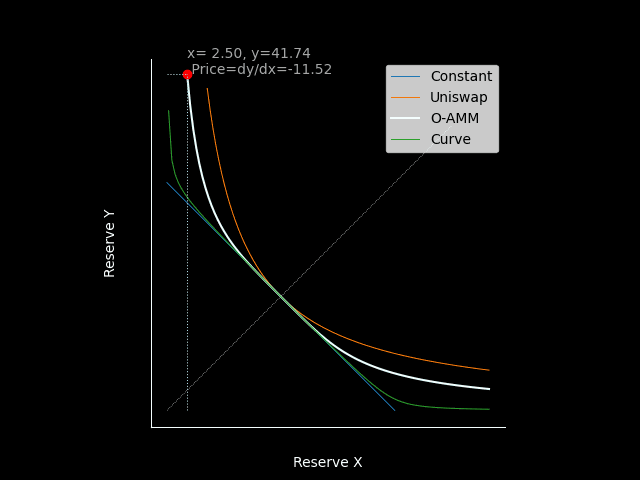

# Designation
## Principle
The basic philosophy of an AMM (automated market maker) is very simple, it obeys a simple rule that the price of token $X$ is as $P_{X|Y}(x,y)=\frac{dy}{dx}$, where $x$ and $y$ is the amount of the reserves of token $X$ and token $Y$. In most situations the expression of $P_{X|Y}(x,y)$ satisfies that the price of token $X$ and its reserve amount $x$ are negatively correlated.  
### Background
The `Uniswap` and `Curve` have done two typical cases. `Uniswap`[1] provides the succinct $xy=k$ as its basic AMM mechanism and works well for tokens on Ethereum, and projects like `Bancor`, `Kyber` have made improvements from `Uniswap`. Simply speaking, they are working for price-unstable tokens.  
`Curve`[2] walks another way, and they have done a great job for the exchanging of price-stable coins. The ideal strategy for stablecoin trading is that one token $X$ always exchange a fixed amount of token $Y$. But in Web3 world the "stable" coin does not always stable at all, so when the pool slopes too much, there needs to be suitable mechanism to solve it. In general, `Curve` provides an ingenious curve that closes to $x+y=\text{const}$ but very steep on the edges of both sides.  

### O-AMM solution
Our solution is different from the above. I will explain our solution just in the case of tokens pair, as it's not very hard to extend to multi-tokens.   
Firstly, we want to make a trading pair's "smoothly trading range" wider than Uniswap. As we know, the marketing curve $xy=k$ is very easy to go into the steep area.  
Secondly, we want the marketing curve can be dynamically adapt to different situations, that is, when $x\approx y$ the marketing curve is closing to `Curve` and when $x$ differs from $y$ much we hope the curve is closing to `Uniswap`.  
The following *equation 1* is the core mechanism of `O-AMM` algorithm:  
$$\alpha(-(x^2+y^2)+bx+by)+2(1-\alpha)C=2xy$$  

Equation.1 the equation of O-AMM
  
where,  

$$\alpha =\frac{xy}{(\frac{x+y}{2})^2}$$  

The expression of $\alpha$ is the quotient of the geometric mean over arithmetic mean, which is a way to quantify the degree of the difference between $x$ and $y$.  
$b$ and $C$ is determined by the liquidity size of the initial pool, and every time the liquidity changes (put in or fetch out), they will be re-calculated.  

$$\left \{ \begin {array}{lcl}
C = x_{init}\cdot y_{init}\\
b = 2\sqrt{C}
\end{array}\right.$$  

The following *Figure 1* shows the difference between `O-AMM` and other AMM mechanisms, the related source code can be found [here](../src/O-AMM/):  
  

Figure.1 the curves of different AMM mechanisms
  

The curve of `O-AMM` is symmetric about $x = y$ like other AMM curves, which is a basic feature of AMM because token $X$ and token $Y$ should be treated equivalently.  
The curve of `O-AMM` lies between `Uniswap` and `Curve`, so in general, it is able to make a dynamic balance between price sensitivity and smoother trading.  

#### General Situation
For a more general situation, there will be arbitrary number of assets in one pool. Suppose $N$ assets $\mathbf{x}=\{x_1,x2,...,x_n\}$ are in a pool. *Equation 1* changes to *Equation 2* as follow:  

$$MS={\alpha}MS+{\alpha}MSn(b-S)+(1-{\alpha})CS$$   

Equation.2 More general expression of O-AMM
 

where:  
* variables $M$, $S$ and $\alpha$ are as below:  

$$\left \{ \begin {array}{lcl}
{\alpha}=\frac{\prod{x_i}}{(\frac{\sum{x_i}}{n})^n}=\frac{M}{(\frac{S}{n})^n} \\  
M=\prod{x_i} \\  
S=\sum{x_i} \\  
\end{array}\right.$$

* constans $C$ and $b$ are as below, which are only determined by the initial value of the reserves and every time the liquidity is deposited or withdrawn:  

$$\left \{ \begin {array}{lcl}
C=\prod{x_{i}^{init}} \\ 
b=n\sqrt[n]{C} 
\end{array}\right.$$

**Note that:**  
* When a swap happens(suppose we use $x_i$ to exchange $x_j$), according to the [equation.2](#equation.2), we can express $M$ and $S$ with just one variable $x_j$, and solving against $x_j$ will be a very easy procedure, just one step. Much easier than what happened in [curve V2](https://classic.curve.fi/files/crypto-pools-paper.pdf).  
* Calculate the price pairs in this pool will be easy too. Note that we have  

    $$F(\mathbf{x})=({\alpha}-1)MS+{\alpha}MSn(b-S)+(1-{\alpha})CS$$  

    and then:  

    $$\frac{dx_i}{dx_j}=-\frac{F_{x_j}}{F_{x_i}}$$  

    and due to the symmetry of $F(\mathbf{x})$, we only need to perform the derivation process once.  

### Gas Mechanism
Solving *equation 1* on-chain is expensive, and we will provide a verifiable computation[3] mechanism to make it.  
General VC (verifiable computation) is complex, but we provide a simple way to solve this customization issue in our situation.    
We just record the expression of *Equation 1* on-chain, calculate $b$ and $C$ every time the liquidity changes. When someone makes swap bwteen token $X$ and token $Y$, he makes `Omniverse Transfer` of one kind of token (take token $X$ for instance) to the abstract-account of the Omniverse Swap, who records the value of $\Delta{x}$. Some off-chain VC nodes are listenning the event of the swaps, they calculate $\Delta{y}$ and submit it to the on-chain `Omniverse Swap`. The verification of $\Delta{x}$ and $\Delta{y}$ within *Equation 1* is very easy and cheap, and the off-chain VC node whose submission is accepted will be rewarded.  

### How O-AMM Comes Out
The way to make out *Equation 1* is somewhat mathematical skilled, but I don't want to explain the details at this stage because we decided to participate in this hackathon so late that there might not be enough time for us. I will give a detailed idea in the future. In short, it is a combination of two equations that are inverse functions of each other.  

## Implementation
* In this stage, we have designed and made out an intuitive [prototype](./solving.py) of the Omniverse AMM algorithm.  
* Besides, we also provide an [on-chain prototype](https://github.com/xiyu1984/O-AMM-ParaSim) for the `off-chain calculation, and on-chain verification` based on a specific verifiable computation, which can be tested manually through an [operation tutorial](https://github.com/xiyu1984/O-AMM-ParaSim/tree/main/off-chain-calc).

## Reference
[1] [white paper-v3](https://uniswap.org/whitepaper-v3.pdf)   
[2] [white paper](https://classic.curve.fi/files/stableswap-paper.pdf)  
[3] [Verifiable computing](https://en.wikipedia.org/wiki/Verifiable_computing)
