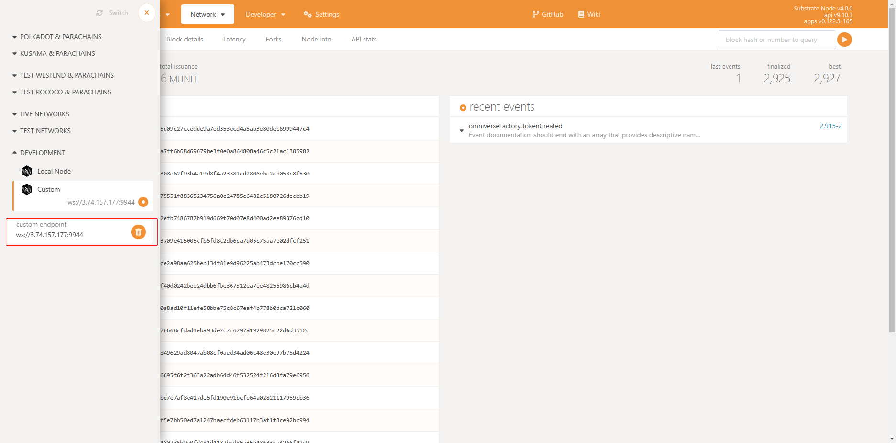

# Tutorial
*This document helps beginners taste the basic functions of `O20k` step by step.*  

## Index
* [Prepare Environment](#environment)
* [Omniverse Account](#omniverse-account)
* [Omniverse Token](#omniverse-token-protocol)
* [Omniverse Swap](#omniverse-swap-protocol)  

## Environment
* [Connection](#connection)
* [Deployment](#deployment)
    * [`O20k` Parachain](#parachain-of-o20k)
    * [EVM chains](#evm-chains)
* [Smart contracts on EVM Chains](#evm-chains)

### Connection
The Parachain of `O20k` is deployed at `ws://3.74.157.177:9944`, and we recommand using [Polkadot.js](https://polkadot.js.org/apps/#/explorer) to connect to it.  

<p align='center'>Figure.1 Connect to `O20k` Parachain</p>  

If succeed, you can find the related pallets at [Extrinsics](https://polkadot.js.org/apps/#/extrinsics):  
  

### Deployment
To make it convenient, we have already deployed two kinds of Omniverse Tokens, token $X$ and token $Y$, which have been already registered onto the pallet of the Omniverse swap on the `O20k` Parachain of Polkadot.  
#### Parachain of `O20k`
* Pallet `OmniverseFactory` is mainly used to make transactions:  
    * The `tokenId` of Token $X$ is `tobedone`
    * The `tokenId` of Token $Y$ is `tobedone`
* Pallet `OmniverseSwap` is mainly used to make exchanges.  

#### EVM chains
The Omniverse tokens are also deployed as smart contracts on some EVM chains.  
* Avalanche
    * Smart contract of Token $X$ address: `0x`
    * Smart contract of token $Y$ address: `0x`
* Moonbeam
    * Smart contract of Token $X$ address: `0x`
    * Smart contract of Token $Y$ address: `0x`

## Omniverse Account
Omniverse operations are all based on the Omniverse account, which is equivalent to the native address on each chain and is interconvertible. When making an operation on a concrete chain(e.g. `O20k` Parachain on Polkadot), we can use the original Polkadot account/address or the Omniverse account. It's transparent for users.  
Currently, we have made a specific tool to operate Omniverse Account.  
* [Install](#oa-tools-install)
* [Create Account](#create-account)
* [Check the Account](#check-the-account)

### OA Tools Install
The Omniverse account tool can be found [here](to be done).  
```sh
# to be done
```

### Create Account
As we mentioned before, the Omniverse account is equivalent to the native account. We can create an new account through the [Polkadot.js/apps](https://polkadot.js.org/apps/#/accounts)
  
<p align='center'>Figure.2 Create an Omniverse account through Polkadot.js/apps</p>  

***Note that***:  
1. Choose `Raw seed`
2. Choose `ECDSA (Non BTC/ETH compatible)` in `keypair crypto type`
3. Record the value of the `secret seed`, which will be used in the Omniverse account tool.

### Check the Account
You can check the information of the account with the `secret seed` mentioned at [previous chapter](#create-account).  
* Set the `secret seed` in the [configure](to be done).  
* Check the information of your account with the command below:  
```sh
# command to get the account information, including:
# @Omniverse Account
# @account on Polkadot
# account on EVM chains
```

## Omniverse Token Protocol
The operations related to the Omniverse Token Protocol(`OTP`) include `Free Mint/Claim`, `balance of`, and `transfer`.  
* [Install](#otp-tools-install)
* [Claim](#free-mintclaim)
* [Check the balance](#check-the-balance)
* [Transaction](#make-transaction-of-omniverse-token)
    * [Initiate on Polkadot](#initiate-transaction-on-polkadot)
    * [Initiate on EVM chains](#initiate-transaction-on-evm-chains)

### `OTP` Tools Install
The Omniverse Token tools can be found [here](to be done).  
```sh
# to be done
```

### Free Mint/Claim
* `Free Mint/Claim` Token $X$:  
```sh
# to be done
```
* `Free Mint/Claim` Token $Y$:
```sh
# to be done
```

### Check the balance
* Check `balance of` Token $X$:  
```sh
# to be done
```
* Check `balance of` Token $Y$:  
```sh
# to be done
```

### Make transaction of Omniverse Token
#### Initiate transaction on Polkadot
* Transfer Token $X$ to another account on Polkadot:
```sh
# to be done
```
* Check `balance of` Token $X$ of related account on Polkadot:  
```sh
# to be done
# `token X` of sender account on Polkadot
# `token X` of receiver account  on Polkadot
```
* Check `balance of` Token $X$ of related account on EVM chains:  
```sh
# to be done
# `token X` of sender account
# `token X` of receiver account
```

#### Initiate transaction on EVM chains
* Transfer Token $X$ to another account on EVM chains:
```sh
# to be done
```
* Check `balance of` Token $X$ of related account on Polkadot:  
```sh
# to be done
# `token X` of sender account on Polkadot
# `token X` of receiver account  on Polkadot
```
* Check `balance of` Token $X$ of related account on EVM chains:  
```sh
# to be done
# `token X` of sender account
# `token X` of receiver account
```

## Omniverse Swap Protocol
The operations related to the Omniverse Swap Protocol(OSP) include `Swap Token X with Token Y` and `Swap Token Y with Token X`. The operations are **just for testing**, so for convenience temporarily we directly provide the interfaces of `X->Y` and `Y->X`.
* [Install](#osp-tools-install)
* [Make exchanges](#make-exchanges)
* [Check the balance](#check-the-balance-after-exchanges)

### `OSP` Tools Install
The Omniverse Swap tools can be found [here](to be done).  
```sh
# to be done
```

### Make exchanges
* Swap Token X with Token Y:  
```sh
# to be done
```
* Swap Token Y with Token X:  
```sh
# to be done
```
### Check the Balance after exchanges
* Check `balance of` Token $X$ of related account on Polkadot:  
```sh
# to be done
# `token X` of related account on Polkadot
```
* Check `balance of` Token $Y$ of related account on EVM chains:  
```sh
# to be done
# `token Y` of related account
```

We can found that the related states changed simultaneously both on Polkadot and EVM chains.  
 