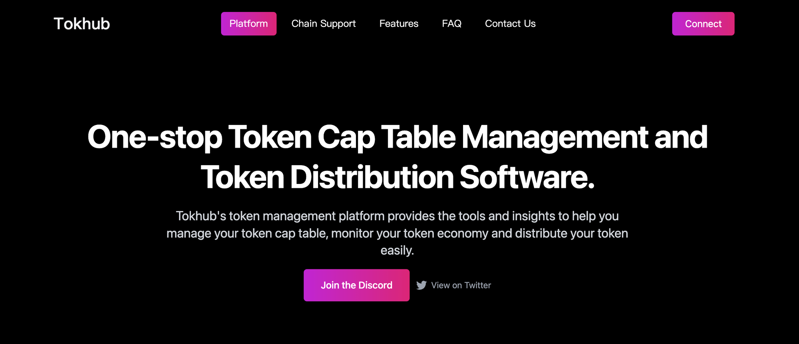
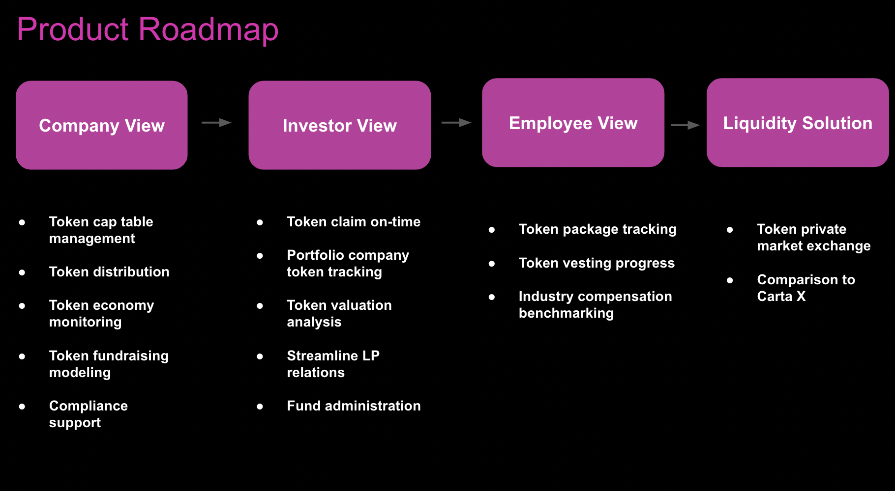
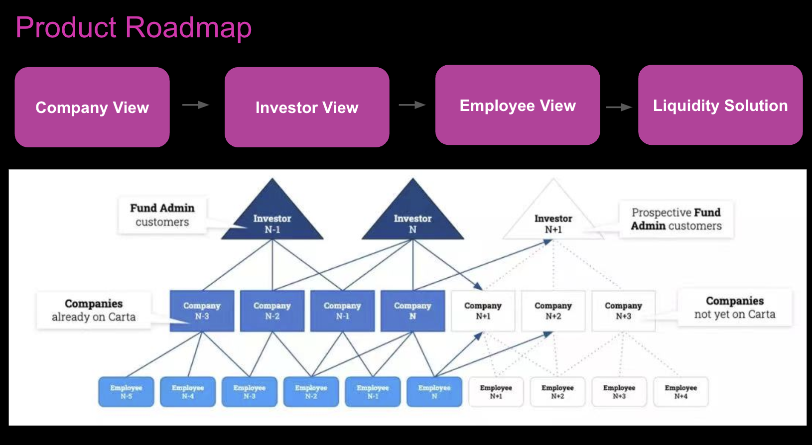
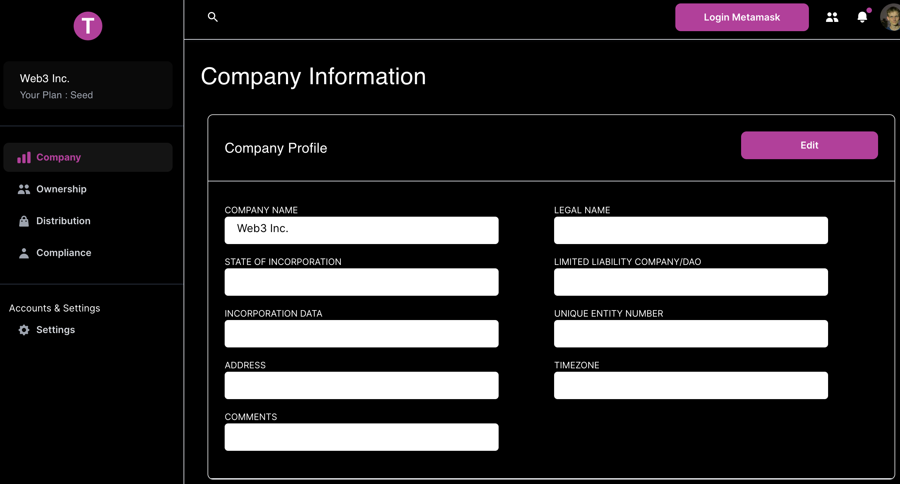
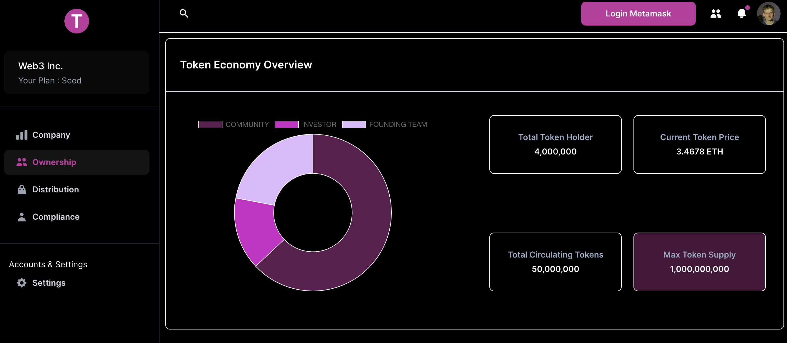
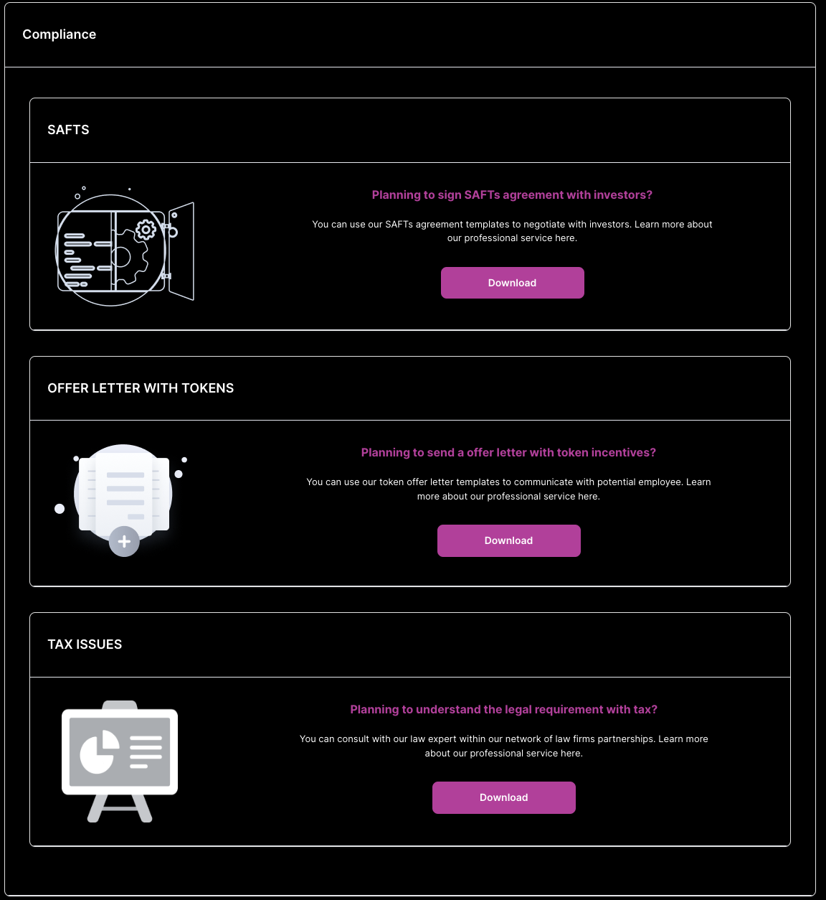
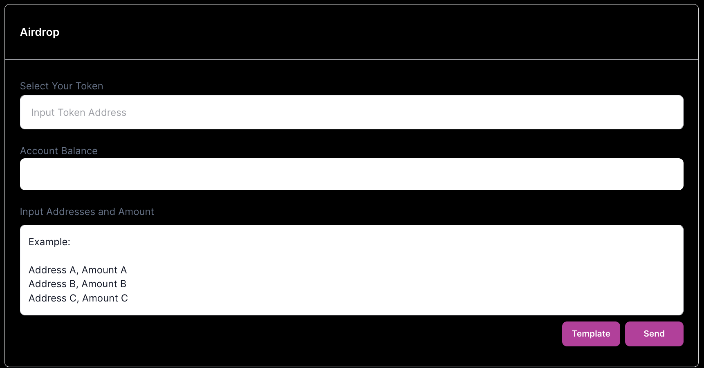
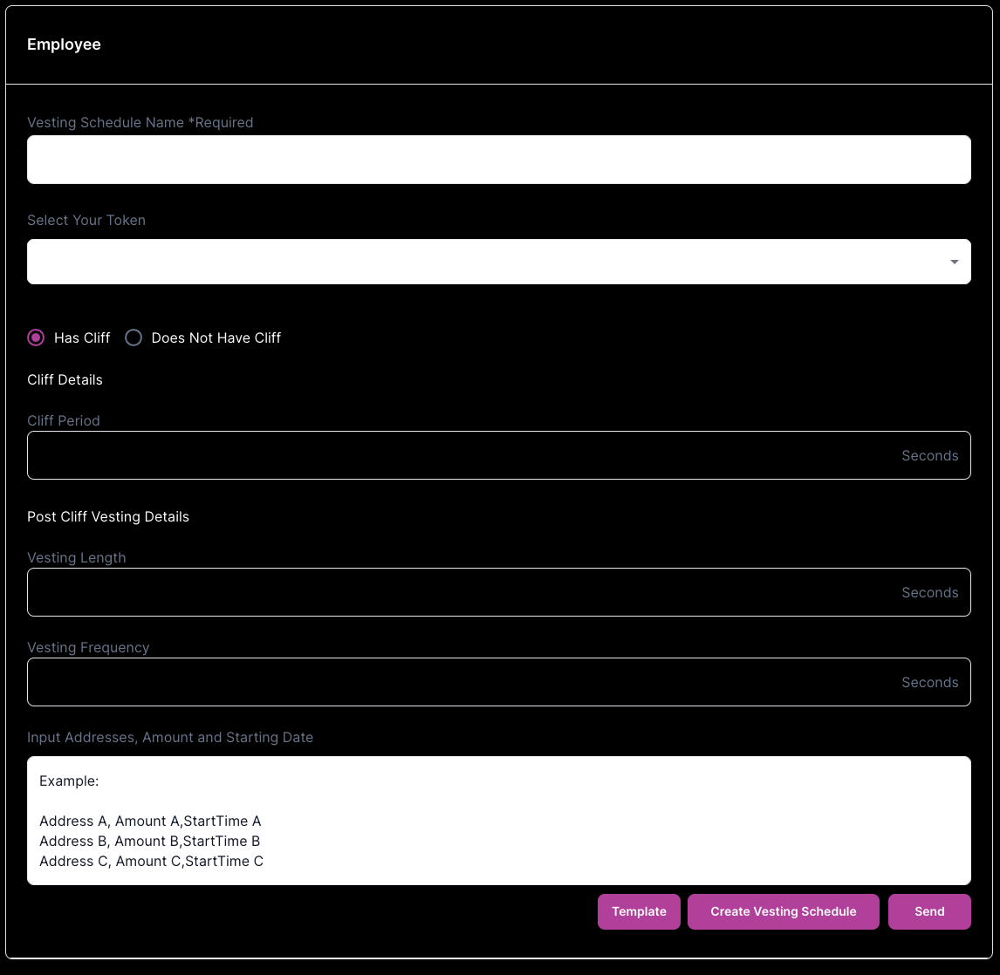
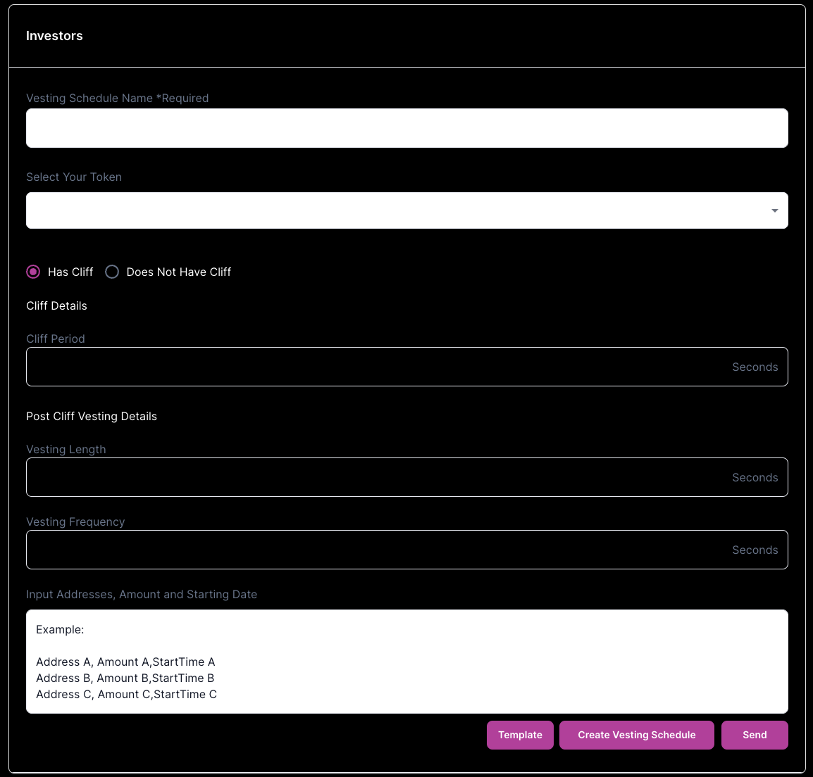

## Project-Tokhub: Carta for web3

Project Starting Time：2022.12

## Project Introduction

**Tokhub's token management and distribution platform** provides the tools and insights to help you manage your token cap table, monitor your token economy and distribute your token easily.

**1.Product roadmap**

**2.Major functionality**

**（1）Plan your token from 0 to 1**: With the help of Tokhub, you can plan and monitor your token economic system (including token supply, token demand, token distribution and token vesting, etc).

**（2）Automating your token management and distribution**: helping crypto founders and crypto investors to track and claim their token through our dashboards(ownership, vesting schedule, etc.), and to distribute tokens automatically through our smart contracts.

**（3）Employment incentive and compliance with token**: Design you employment token incentives, manage your token offer letters, legal agreements (SAFTs, token warrants, token grants) and keep compliant under regulation scrutiny.

## Buidl Plan During Hackathon：

**1.Front end**

- `Token Management`

  - [ ] Company information: company onboard by filling in information such as: company name, legal name, state of incorporation, address, signatories, board members, etc.
  - [ ] Token ownership: track token ownership, monitor token economy and vesting progress, etc.
  - [ ] Token distribution: airdrop, investor and employee, etc.(strongly related to crypto payments)
  - [ ] Compliance: SAFTS, token offer letter templates, tax issues, etc.

**2.Contract**

- `Token distribution`

  - [ ] Airdrop: distribute tokens to multiple wallet addresses in one click
  - [ ] Investor Vesting Schedule: distribute tokens to different investors according to customized vesting schedule
  - [ ] Employee Vesting Schedule: distribute tokens to employee according to customized token option agreement

## Code Finished During Hackathon

Finished the function of token management dashboard & token distribution contract

Currently deployed on BSC testnet, will deploy on Moonbase Alpha Testnet before demoday

## Team Member

Troy, Founder(wechat: ywccome)
Bytedance strategy
Founder in Residence, EF
Tsinghua University

Walter, Co-founder
Apple & Amazon engineer
Zhejiang University

Murph, Co-founder
VC investors and in-coming Bytedance engineer（Volcengine, 火山引擎）
Tsinghua University

Alan, Engineer
Contract engineer
Hacker in Antalpha Hacker House

Pengcheng, Engineer
Contract engineer
Hacker in Antalpha Hacker House

Li Jun, Engineer
Contract engineer
Hacker in Defi Space

## More Information

Presentation: https://docs.google.com/presentation/d/1uIbTMpX8DVYJuSSlIeaklLTIjjsSUBXmUBZUK0pYeos/edit#slide=id.g1c1ebd29a09_0_35

Demo: https://www.youtube.com/watch?v=8OxU-xlspQc (In chinese, will issue our English demo soon)

Notion: https://antalpha.notion.site/Tokhub-Carta-for-Web3-41074f2cda714006bb7441159cace007

Twitter: https://twitter.com/TokHub22

Discord: https://discord.gg/mYfy5fvSrz
