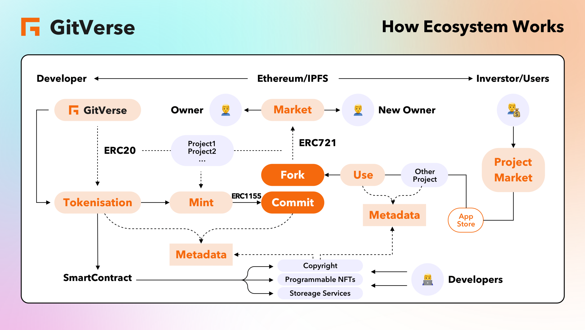
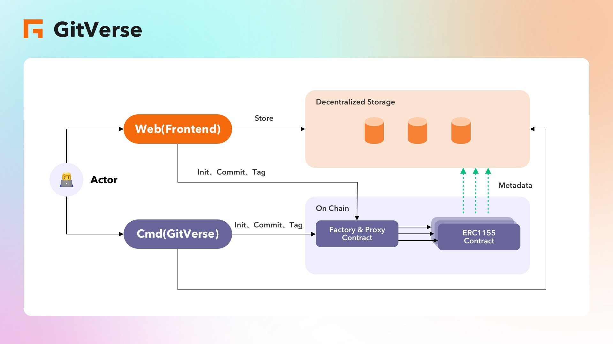
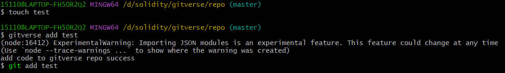

# Github Readme

# Readme内容

---

# Basic Information

Project name：Gitverse

Starting time：2022-12-15

Code Address：https://github.com/GitverseEth/gitverse

# Project Description

# Vision and Mission

**Vision:** To become a value network for global open-source projects and their developers

**Mission:** Realize the value network of open-source projects and incentives for developers through programmable code NFTs and decentralized code storage.

---

# Problem and Opportunity

## Problem

1.Traditional open-source projects have created huge technical value but lack of business model.

2.Lack of business model leads to lack of sustainable incentives for developers in open source projects

3.Existing open-source licenses has too little copyright protection for open source projects, has certain technical limitations.

## Opportunity

Without violating the spirit of open source, the ecology of Web3 may bring new solutions and business models to empower open-source.

---

# Our Solution

- **Programmable code-NFTs - addressing the value and incentives of open source projects**
- **Decentralized code hosting - trusted computing and storage**
- **Web3 open source Copyright license - copyright traceability of open source projects**

# **Programmable code-NFTs**

## Core Logic

Gitverse supports open-source projects to mint programmable NFTs to realize project copyright tracking, value accumulation, and developer ecological incentives.

## Smart Contract Design

### 1.How to express dependencies between projects

1. Example: Project A depends on project B and project C, and projects A, B, and C correspond to contracts ERC1155-A, ERC1155-B, and ERC1155-C respectively (of course, the project is not limited to ERC1155, and the project can also be ERC721, ERC3525)
Solution: There is a mapping in the contract ERC1155-A, indicating the dependency (array or mapping) corresponding to the current version (tokenID), and the token address of the element ERC1155-B and ERC1155-C exists in the dependency array, and the elements in the array cannot be repeated.
2. If the dependency is removed (for example, the current version no longer depends on project A), the token address in the dependency array needs to be deleted synchronously

### 2.How to express the iteration of the project (the growth of the project)

Problem: Each project will have iterations of versions, and each iteration will be different.
Solution: You can regard a project as a collection, and each project has different versions, which correspond to the tokenId of the collection. It's just that the collection does not set the total supply of tokenId (in fact, it is determined by the upper limit of uint256)

## Value

- Programmable code-NFTs can dynamically record the copyright of open source projects (ownership/compliance with project dependencies under open source agreements)
- Programmable code-NFTs can be used for developer incentives in the open source ecosystem, and identity authentication for developers and users
- The release logic of programmable code-NFTs greatly reduces the risk of over-release in the early stage of the project, and the value grows with the growth of the project itself (version update, developer ecology, project dependency)

# **Decentralized code hosting**

## Gitverse command-line

Gitverse supports the command line

1. gitverse init
Create a gitverse code warehouse in the current directory, and create a smart contract based on the repository name;
2. gitverse add <pathlist...>
Add the specified file or directory to the gitverse code staging area
3. gitverse tag <tagName>
Create a new tag, and push all the code of the tag to the gitverse code warehouse at the same time.
4. gitverse commit -m comments
Submit the code in the temporary storage area to the gitverse warehouse area. Currently, all codes are uploaded to the gitverse code warehouse based on the commitId point, and later optimized to only upload the code that is different from the previous commitId.

## Value

- **Cheap.** Distributed storage space is not provided by service providers, but by nodes connected to the network, which is very cheap as a private warehouse.
- **high speed.** Distributed storage naturally has the function of CDN acceleration.
- **Data security and traceability.** When the system detects that the file is lost, it will automatically recover and resist DDOS, and the data can be traced back.

---

# How it works

# How Ecosystem Works

# **Technical Architecture**

# Functions completed during hackathon delivery黑客松期间完成的事项

- [ ]  **Realize the  core logic of Programmable code-NFTs**

Open source project A released ⇒ Generated ⇒ New ERC1155 NFT TokenID 1 ⇒ Generated ⇒ ERC721 NFT anchoring A’s market value.

(Open source project, individual developer) Project B ⇒ Dependency A ⇒ New ERC1155 NFT TokenID 2.

B uses A as one of its package dependencies: Token1 metadata:add TokenID2(A) to dependent list of TokenID1(B) 

Token1 ⇒ totalSupply of ERC721 Token + 1.

ERC1155 records the version, contribution and dependency information of the project

ERC721 represents the value of the project.

- [ ]  **Implement the Gitverse command-line**

gitverse init

gitverse add <pathlist...>

gitverse tag <tagName>

gitverse commit -m comments

- [ ]  Support version and branch management of project files stored in IPFS/CESS
- [ ]  Find out the content of each new submission in the .git directory

# See More

- Videos:
[https://youtu.be/0eBAB9rtWJI](https://youtu.be/0eBAB9rtWJI)

> Introduction
> 
> 
> 
> Show how demo works:
> 
- Contract Example Online:

[https://moonbase.moonscan.io/address/0xd6bc22cbe64ef84b9bd0015ba06c67aea134d13f#code](https://youtu.be/0eBAB9rtWJI)

- Other Files:

Project Pitch Deck: https://github.com/GitverseEth/hackathon-2022-winter/blob/main/teams/Gitverse-37/GitVerse-deck.pdf
